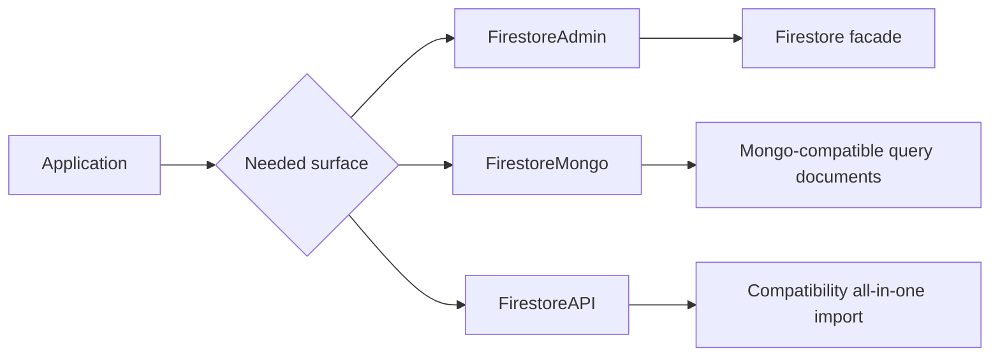
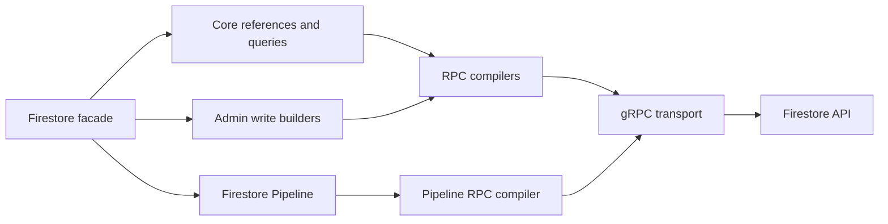

# FirebaseAPI

FirebaseAPI is a Swift package for server-side Cloud Firestore access over
gRPC. It provides a Firebase-style public API for documents, queries,
transactions, batches, listeners, Codable models, native geohash queries,
Firestore Pipeline, and MongoDB-compatible query documents.

The recommended 2.x Admin entry point is:

```swift
import FirestoreAdmin

let firestore = try Firestore.applicationDefault()
```

## Requirements

| Requirement | Version |
|---|---:|
| Swift | 6.2+ |
| macOS | 15.0+ |
| iOS | 18.0+ |
| watchOS | 11.0+ |
| tvOS | 18.0+ |
| visionOS | 2.0+ |

## Products

FirebaseAPI intentionally exposes three SwiftPM products.

| Product | Use this when | Public shape |
|---|---|---|
| `FirestoreAdmin` | Building a new server-side Firestore service | Imports the `Firestore` facade, Admin builders, Codable helpers, Auth, Core, Pipeline, RuntimeConfig, and native GeoQuery |
| `FirestoreMongo` | Building MongoDB-compatible query/index documents | Imports Mongo-compatible GeoJSON, `$near`, and `2dsphere` document builders |
| `FirestoreAPI` | Keeping an existing all-in-one import working | Re-exports Admin, Core, Codable, Pipeline, Auth, GeoQuery, and Mongo-compatible helpers |



`FirestoreAdmin` is the product/module name. `Firestore` is the public runtime
facade type. The old `FirestoreAdmin` facade type is not part of the 2.x API.

## Installation

Add the package dependency:

```swift
dependencies: [
    .package(url: "https://github.com/1amageek/FirebaseAPI.git", from: "2.0.0")
]
```

Add the product you need:

```swift
.target(
    name: "YourService",
    dependencies: [
        .product(name: "FirestoreAdmin", package: "FirebaseAPI")
    ]
)
```

Add `FirestoreMongo` only for MongoDB-compatible query document construction:

```swift
.product(name: "FirestoreMongo", package: "FirebaseAPI")
```

## Quick Start

```swift
import FirestoreAdmin

let credentials = try ServiceAccountCredentials.load(from: serviceAccountJSONURL)
let firestore = try Firestore(credentials: credentials)

let city = try firestore.collection("cities").document("tokyo")

try await city.setData([
    "name": "Tokyo",
    "country": "JP",
    "population": 14_000_000,
    "updatedAt": FieldValue.serverTimestamp()
])

let snapshot = try await city.getDocument()
print(snapshot.data() ?? [:])

await firestore.shutdown()
```

Call `shutdown()` during service teardown so the gRPC client stops accepting new
RPCs and drains in-flight requests.

## Authentication

### Service Account JSON

```swift
import FirestoreAdmin

let credentials = try ServiceAccountCredentials.load(from: serviceAccountJSONURL)
let firestore = try Firestore(credentials: credentials)
```

### Application Default Credentials

Use this when the project ID is available synchronously from the environment or
well-known ADC file:

```swift
let firestore = try Firestore.applicationDefault()
```

Use this on Google Cloud runtimes where the metadata server may provide the
project ID asynchronously:

```swift
let firestore = try await Firestore.applicationDefaultResolvingProjectID()
```

### Firestore Emulator

```swift
let firestore = try Firestore.emulator(
    projectId: "demo-project",
    host: "127.0.0.1",
    port: 8080
)
```

### Custom Transport

Host-provided transports are useful for Wasm and embedded runtimes.

```swift
let firestore = Firestore.admin(
    projectId: "demo-project",
    transport: transport,
    settings: .hostManagedAuthentication()
)
```

## Documents and Codable

```swift
import FirestoreAdmin

struct City: Codable {
    @DocumentID var id: String
    @ReferencePath var path: String
    @ServerTimestamp var updatedAt: Timestamp?

    var name: String
    var country: String
    var population: Int
}

let cities = try firestore.collection("cities")
let tokyo = try cities.document("tokyo")

try await tokyo.setData([
    "name": "Tokyo",
    "country": "JP",
    "population": 14_000_000
])

try await tokyo.updateData([
    "population": 14_100_000,
    "updatedAt": FieldValue.serverTimestamp()
])

let city = try await tokyo.getDocument(as: City.self)
let allCities = try await cities.getDocuments(as: City.self)
```

Supported convenience wrappers include `@DocumentID`, `@ReferencePath`,
`@ExplicitNull`, and `@ServerTimestamp`.

## Queries

```swift
let cities = try firestore.collection("cities")

let snapshot = try await cities
    .whereField("country", isEqualTo: "JP")
    .whereField("population", isGreaterThanOrEqualTo: 1_000_000)
    .order(by: "population", descending: true)
    .limit(to: 20)
    .getDocuments()

for document in snapshot.documents {
    print(document.documentID, document.data())
}
```

Composite filters are built with `Filter`:

```swift
let filter = Filter.orFilter(with: [
    Filter.filter(whereField: "country", isEqualTo: "JP"),
    Filter.filter(whereField: "country", isEqualTo: "US")
])

let snapshot = try await cities
    .whereFilter(filter)
    .order(by: "name")
    .getDocuments()
```

Aggregations and Explain are first-class query operations:

```swift
let count = try await cities.count()
let averagePopulation = try await cities.average("population")
let plan = try await cities.explain(options: .planOnly)
```

## Transactions, Batches, and Bulk Writes

Use transactions when reads and writes must be coordinated:

```swift
let updatedPopulation = try await firestore.runTransaction { transaction in
    let reference = try firestore.document("cities/tokyo")
    let snapshot = try await transaction.getDocument(reference)
    let population = snapshot.data()?["population"] as? Int ?? 0
    let nextPopulation = population + 1

    transaction.updateData(
        ["population": nextPopulation],
        forDocument: reference
    )

    return nextPopulation
}
```

Use `batch()` for atomic write groups:

```swift
let batch = firestore.batch()

batch.setData(["name": "Tokyo"], forDocument: try firestore.document("cities/tokyo"))
batch.setData(["name": "Osaka"], forDocument: try firestore.document("cities/osaka"))

try await batch.commit()
```

Use `bulkWriter()` for non-atomic high-throughput writes backed by Firestore
`BatchWrite`:

```swift
let writer = firestore.bulkWriter()

writer.setData(["name": "Tokyo"], forDocument: try firestore.document("cities/tokyo"))
writer.setData(["name": "Osaka"], forDocument: try firestore.document("cities/osaka"))

let result = try await writer.flush(labels: ["job": "city-import"])
print(result.results)
```

| API | Firestore RPC behavior | Atomic |
|---|---|---:|
| `DocumentReference.setData`, `updateData`, `delete` | `Commit` | Yes, per call |
| `firestore.batch().commit()` | `Commit` | Yes |
| `firestore.runTransaction` | `BeginTransaction`, reads, `Commit`, optional `Rollback` | Yes |
| `firestore.bulkWriter().flush()` | `BatchWrite` | No |

## Listeners

Server-side listeners use `AsyncSequence`.

```swift
let reference = try firestore.document("cities/tokyo")

for try await snapshot in reference.snapshots {
    if snapshot.exists {
        print(snapshot.data() ?? [:])
    }
}
```

```swift
let query = try firestore.collection("cities")
    .whereField("country", isEqualTo: "JP")

for try await snapshot in query.snapshots {
    print(snapshot.documents.count)
}
```

Cancel the surrounding task to stop listening.

## Native GeoQuery

Native geo queries use a geohash field plus a `GeoPoint` field. FirebaseAPI
builds the geohash range queries and filters the returned documents by exact
distance.

```swift
let places = try firestore.collection("places")
let location = GeoPoint(latitude: 35.681236, longitude: 139.767125)
let reference = try places.document("tokyo-station")

try await reference.setData([
    "name": "Tokyo Station",
    "geohash": try FirestoreGeoHash.encode(location),
    "location": location
])

let results = try await places
    .geoQuery(
        center: location,
        radiusInMeters: 1_000,
        geohashField: "geohash",
        locationField: "location"
    )
    .getDocuments()

for result in results {
    print(result.document.documentID, result.distanceInMeters)
}
```

Native GeoQuery is separate from MongoDB-compatible `$near` query document
construction.

## Vector Search

```swift
let vector = FirestoreVector([0.12, 0.42, 0.86])

let snapshot = try await firestore.collection("articles")
    .findNearest(
        vectorField: "embedding",
        queryVector: vector,
        limit: 10,
        distanceMeasure: .cosine,
        distanceResultField: "distance"
    )
    .getDocuments()
```

## Firestore Pipeline

Firestore Pipeline is exposed through a typed builder and executed by the Admin
runtime.

```swift
let pipeline = firestore.pipeline()
    .collection("cities")
    .where(PipelineValue.field("population").greaterThan(1_000_000))
    .sort([PipelineValue.field("population").descending()])
    .limit(10)

let rows = try await firestore.execute(pipeline)
let explanation = try await firestore.explain(pipeline)
```

Pipeline query construction is intentionally separate from normal Firestore
`Query` construction and from MongoDB-compatible query documents.

## MongoDB-Compatible Query Documents

`FirestoreMongo` builds MongoDB-compatible query/index documents. It does not
execute them through the native Firestore gRPC Admin runtime.

```swift
import FirestoreMongo

let point = try FirestoreMongoGeoJSONPoint(
    longitude: 139.767125,
    latitude: 35.681236
)

let query = try FirestoreMongoGeoNearQuery(
    fieldPath: "location",
    point: point,
    maxDistanceMeters: 1_000
)

let index = try FirestoreMongoGeoIndex(fieldPath: "location")

print(query.document)
print(index.document)
```

## Wasm Boundary

`FirestoreAdmin` and `FirestoreAPI` build for WASI with a host-provided
`GRPCCore.ClientTransport`. Default Posix networking is not available in WASI,
so runtime execution must enter through the custom transport initializer and
host-managed authentication:

```swift
let firestore = Firestore.admin(
    projectId: "demo-project",
    transport: transport,
    settings: .hostManagedAuthentication()
)
```

See [docs/FirestoreWasmBoundary.md](docs/FirestoreWasmBoundary.md) for the
full boundary contract.

## Architecture

The public API keeps user-facing Firestore values separate from protobuf,
generated gRPC stubs, and concrete transport execution.



Important design records:

| Document | Purpose |
|---|---|
| [FirestoreAdminCompatibility.md](docs/FirestoreAdminCompatibility.md) | SDK-compatible server-side API decisions |
| [FirestoreModuleSeparationPlan.md](docs/FirestoreModuleSeparationPlan.md) | Target and dependency boundaries |
| [FirestoreMongoCompatibility.md](docs/FirestoreMongoCompatibility.md) | Native vs Mongo-compatible geospatial boundary |
| [FirestoreWasmBoundary.md](docs/FirestoreWasmBoundary.md) | Wasm build and host transport boundary |
| [FirestoreAdminCompletionAudit.md](docs/FirestoreAdminCompletionAudit.md) | Release readiness evidence |

## Development

Initialize submodules before regenerating protobuf sources:

```bash
git submodule update --init --recursive
```

Regenerate Firestore protobuf and gRPC stubs:

```bash
./scripts/generate-firestore-protos.sh
```

Build the public products:

```bash
swift build --product FirestoreAdmin
swift build --product FirestoreAPI
swift build --product FirestoreMongo
```

Run the test suite:

```bash
perl -e 'alarm shift; exec @ARGV' 90 xcodebuild -scheme FirebaseAPI-Package -destination 'platform=macOS' test
```

The current suite contains 406 tests across 19 suites.

Run the release-readiness gate:

```bash
bash scripts/check-release-readiness.sh
```

The release-readiness gate builds public products, runs the Swift Testing suite,
dumps public symbol graphs, and rejects protobuf, gRPC transport, or internal
query-planning symbols in public API.

## Integration Tests

Firestore emulator tests are enabled when `FIRESTORE_EMULATOR_HOST` is set.

```bash
XDG_CONFIG_HOME=/tmp/firebase-cli-config \
firebase emulators:exec --only firestore --project firebase-api-emulator-test \
"perl -e 'alarm shift; exec @ARGV' 180 xcodebuild -scheme FirebaseAPI-Package -destination 'platform=macOS' test"
```

Optional emulator variables:

| Variable | Purpose |
|---|---|
| `FIRESTORE_EMULATOR_PROJECT_ID` | Override the emulator project ID |
| `FIRESTORE_EMULATOR_DATABASE_ID` | Override the emulator database ID |
| `FIRESTORE_EMULATOR_PIPELINE_SMOKE=1` | Enable opt-in Pipeline emulator smoke tests |

Live Firestore smoke testing is opt-in.
Application Default Credentials can come from `GOOGLE_APPLICATION_CREDENTIALS`,
the gcloud well-known ADC file, or the Google Cloud metadata server.

```bash
FIRESTORE_LIVE_SMOKE=1 \
FIRESTORE_LIVE_PROJECT_ID=your-project-id \
bash scripts/run-live-firestore-smoke.sh
```

Use diagnostics-only mode to inspect credential and project-ID candidates without
running production RPCs:

```bash
FIRESTORE_LIVE_SMOKE=1 \
FIRESTORE_LIVE_DIAGNOSTICS_ONLY=1 \
bash scripts/run-live-firestore-smoke.sh
```

## Dependencies

| Dependency | Role |
|---|---|
| `grpc-swift-2` | gRPC core API |
| `grpc-swift-nio-transport` | Default HTTP/2 client transport |
| `grpc-swift-protobuf` | Protobuf serialization for gRPC |
| `swift-protobuf` | Protocol Buffer runtime |
| `swift-crypto` | Service account JWT signing |
| `swift-log` | Logging |

## License

FirebaseAPI is available under the MIT License. See [LICENSE](LICENSE).
