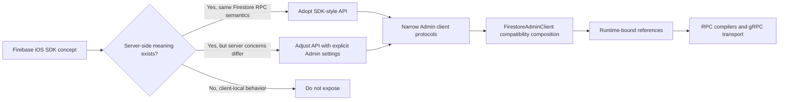
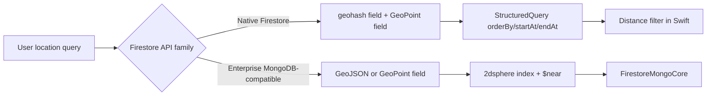

# Firestore Admin Compatibility Matrix

Status: Accepted

Last reviewed: 2026-06-27

## Context

FirebaseAPI exposes a Swift Firestore Admin API for server-side applications. The public API should feel familiar to developers who know Firebase iOS SDK, but it must not expose client-only behavior such as offline persistence, local cache reads, network enable/disable controls, or app-instance lifecycle APIs.

Official references used for this decision:

- [Firestore Swift API reference](https://firebase.google.com/docs/reference/swift/firebasefirestore/api/reference/Classes/Firestore)
- [CollectionReference Swift API reference](https://firebase.google.com/docs/reference/swift/firebasefirestore/api/reference/Classes/CollectionReference)
- [DocumentReference Swift API reference](https://firebase.google.com/docs/reference/swift/firebasefirestore/api/reference/Classes/DocumentReference)
- [Query Swift API reference](https://firebase.google.com/docs/reference/swift/firebasefirestore/api/reference/Classes/Query)
- [WriteBatch Swift API reference](https://firebase.google.com/docs/reference/swift/firebasefirestore/api/reference/Classes/WriteBatch)
- [Transaction Swift API reference](https://firebase.google.com/docs/reference/swift/firebasefirestore/api/reference/Classes/Transaction)
- [Firestore RPC BatchWrite](https://cloud.google.com/firestore/docs/reference/rpc/google.firestore.v1#google.firestore.v1.Firestore.BatchWrite)
- [Firestore RPC ListDocuments](https://cloud.google.com/firestore/docs/reference/rpc/google.firestore.v1#google.firestore.v1.Firestore.ListDocuments)
- [Firestore aggregation queries](https://firebase.google.com/docs/firestore/query-data/aggregation-queries)
- [Firestore vector search](https://firebase.google.com/docs/firestore/vector-search)
- [Firestore Pipeline operations](https://firebase.google.com/docs/firestore/pipelines/get-started-with-pipelines)
- [Firestore Pipeline subqueries](https://firebase.google.com/docs/firestore/pipelines/perform-joins-with-sub-pipelines)
- [Firestore Pipeline arithmetic functions](https://firebase.google.com/docs/firestore/pipelines/functions/arithmetic-functions)
- [Firestore Pipeline aggregate functions](https://firebase.google.com/docs/firestore/pipelines/functions/aggregate-functions)
- [Firestore Pipeline array functions](https://firebase.google.com/docs/firestore/pipelines/functions/array-functions)
- [Firestore Pipeline comparison functions](https://firebase.google.com/docs/firestore/pipelines/functions/comparison-functions)
- [Firestore Pipeline debugging functions](https://firebase.google.com/docs/firestore/pipelines/functions/debugging-functions)
- [Firestore Pipeline generic functions](https://firebase.google.com/docs/firestore/pipelines/functions/generic-functions)
- [Firestore Pipeline logical functions](https://firebase.google.com/docs/firestore/pipelines/functions/logical-functions)
- [Firestore Pipeline map functions](https://firebase.google.com/docs/firestore/pipelines/functions/map-functions)
- [Firestore Pipeline reference functions](https://firebase.google.com/docs/firestore/pipelines/functions/reference-functions)
- [Firestore Pipeline string functions](https://firebase.google.com/docs/firestore/pipelines/functions/string-functions)
- [Firestore Pipeline timestamp functions](https://firebase.google.com/docs/firestore/pipelines/functions/timestamp-functions)
- [Firestore Pipeline type functions](https://firebase.google.com/docs/firestore/pipelines/functions/type-functions)
- [Firestore Pipeline vector functions](https://firebase.google.com/docs/firestore/pipelines/functions/vector-functions)
- [Firestore Pipeline Search stage](https://firebase.google.com/docs/firestore/pipelines/stages/transformation/search)
- [Firestore Pipeline Find Nearest stage](https://firebase.google.com/docs/firestore/pipelines/stages/transformation/find-nearest)
- [Firestore Pipeline DML](https://firebase.google.com/docs/firestore/pipelines/dml)
- [Firestore RPC PartitionQuery](https://cloud.google.com/firestore/docs/reference/rpc/google.firestore.v1#google.firestore.v1.Firestore.PartitionQuery)
- [Firestore geoqueries solution](https://firebase.google.com/docs/firestore/solutions/geoqueries)
- [Firestore Enterprise MongoDB-compatible geo queries](https://firebase.google.com/docs/firestore/enterprise/geo-query-mongodb)
- [Firestore RPC implementation audit](FirestoreRPCAudit.md)
- [Firestore Mongo-compatible responsibility boundary](FirestoreMongoCompatibility.md)
- [Firestore module separation plan](FirestoreModuleSeparationPlan.md)

## Decision

Use Firebase iOS SDK naming where the semantic contract is the same, and require explicit server-side behavior where the client SDK relies on app-local state.

Server-side code depends on the narrowest Admin protocol that matches the workflow: `FirestoreAdminReferenceClient`, `FirestoreAdminWriteClient`, `FirestoreAdminTransactionClient`, `FirestoreAdminPipelineClient`, or `FirestoreAdminLifecycleClient`. `FirestoreAdminClient` remains as a source-compatible composition of those smaller protocols for full-featured dependency injection and test doubles. `FirestoreAdmin` is the runtime-backed implementation of those protocols, `FirestoreAdminCodable` owns SDK-style Codable overloads for Admin builders and transactions, and `FirestoreAdminGRPCBootstrap` owns the production gRPC-backed construction paths. The internal `FirestoreRuntime` protocols remain implementation seams for references, queries, batches, and transactions.

Public test doubles must be able to return Admin result values without importing protobuf or grpc-swift modules. `DocumentReference`, `CollectionReference`, `CollectionGroup`, `DocumentSnapshot`, `QueryDocumentSnapshot`, `QuerySnapshot`, `PipelineQueryRow`, and `PipelineQuerySnapshot` therefore expose public factories from project/database identifiers and `[String: Any]` snapshot data. `FirestoreAdminWriteBatch` and `FirestoreAdminBulkWriter` expose public fake/adaptor factories whose callbacks receive `FirestoreAdminWriteOperation` summaries instead of package-only `WriteData`. These factories create unbound values for tests and adapters; server operations still require runtime-bound values created by `FirestoreAdmin`.

Generated protobuf and gRPC files are implementation details. They live in separate SwiftPM targets, regeneration uses `Visibility=Package`, and the package must keep `FirestoreProtobuf` and `FirestoreGRPCStubs` as non-product target dependencies. `Visibility=Internal` only works while generated files and RPC/transport code are compiled in one target, and `Visibility=Public` must not become the default public API escape hatch.

The preferred server-side application import is the `FirestoreAdminServer` product. It re-exports the Admin facade, Admin Codable helpers, gRPC bootstrap, Auth, Core, Codable, Pipeline, RuntimeConfig, and Native GeoQuery modules while keeping MongoDB-compatible query documents and low-level RPC/protobuf/transport implementation symbols out of the re-exported public API surface. `FirestoreAPI` remains the source-compatible all-in-one import for existing applications, including the Mongo-compatible query-document target for compatibility. New MongoDB-compatible work should depend on the explicit `FirestoreMongoCore` product until a separate Mongo-compatible Admin product exists.

## Compatibility Matrix

| iOS SDK surface | FirestoreAdmin decision | Rationale |
|---|---|---|
| `Firestore.collection(_:)` | Adopt as `FirestoreAdmin.collection(_:) throws` | Same reference-building concept, but server-side path validation throws typed errors instead of trapping. |
| `Firestore.document(_:)` | Adopt as `FirestoreAdmin.document(_:) throws` | Same reference-building concept with typed invalid path errors. |
| `Firestore.collectionGroup(_:)` | Adopt as `FirestoreAdmin.collectionGroup(_:) throws` | Same query target concept. |
| Public reference and snapshot factories | Adopt for Admin client protocol test doubles | External fake clients can construct references and read result values without protobuf, gRPC transport, or internal `Database`/`FirestoreDocumentValue` access. Factories accept project/database identifiers, validated paths, and stored Firestore-compatible `[String: Any]` values. Write-only `FieldValue` sentinels are rejected. |
| Existing `collectionReference`, `documentReference`, and `collectionGroupReference` aliases | Removed before stable release | Canonical API is SDK-style naming; non-canonical aliases should not remain in the public Admin surface. |
| `CollectionReference.document(_:)` | Adopt as `CollectionReference.document(_:) throws` | Same child document concept; generated IDs remain local and deterministic enough for request construction. |
| `DocumentReference.collection(_:)` | Adopt as `DocumentReference.collection(_:) throws` | Same subcollection concept with path validation. |
| `DocumentReference.getDocument()` | Adopt | Direct server read through RPC. |
| `DocumentReference.getDocument(as:)`, `CollectionReference.getDocuments(as:)`, `CollectionGroup.getDocuments(as:)`, and `Query.getDocuments(as:)` | Adopt as SDK-style typed read aliases | Decode through fetched snapshots and `FirestoreDecoder`, preserving the server-side runtime boundary. Existing `type:` helpers remain as compatibility aliases during the Admin transition. `CollectionGroup` direct reads forward through `Query` with `allDescendants == true`. |
| `DocumentReference.getDocument(source:)`, `CollectionReference.getDocuments(source:)`, `CollectionGroup.getDocuments(source:)`, and `Query.getDocuments(source:)` | Adopt with server semantics | Accepts `FirestoreSource` for SDK-style source compatibility. `.default` and `.server` dispatch to server RPCs; `FirestoreSource.cache` is rejected because server-side Admin has no local cache. |
| `DocumentSnapshot.data(as:)`, `QueryDocumentSnapshot.data(as:)`, and `QuerySnapshot.documents(as:)` | Adopt | Decode fetched snapshots through `FirestoreDecoder`, including `@DocumentID`, `Data`, and `FirestoreVector` read conversion. |
| `DocumentSnapshot.get(...)`, `QueryDocumentSnapshot.get(...)`, snapshot subscripts, and `data(with:)` | Adopt with server semantics | Reads already-fetched snapshot data without touching RPC. String field paths address nested maps, typed `FieldPath` preserves literal segments, `QueryDocumentSnapshot.data()` is non-optional because query results contain existing documents, and `ServerTimestampBehavior` is accepted as a server-side no-op because Admin reads only synchronized server values. |
| `DocumentSnapshot.reference`, `DocumentSnapshot.documentID`, `QueryDocumentSnapshot.reference`, and `QueryDocumentSnapshot.documentID` | Adopt | Mirrors Firebase SDK snapshot naming while keeping `id` aliases for `Identifiable` compatibility. |
| Reference and Query identity mutability | Immutable after construction | `DocumentReference.documentID`, `CollectionReference.collectionID`, `CollectionGroup.groupID`, and `Query.collectionID` are read-only. Query builders return new `Query` values instead of mutating a runtime-bound source. |
| Snapshot and Firestore scalar mutability | Immutable result values | `DocumentSnapshot`, `QueryDocumentSnapshot`, `QuerySnapshot`, `SnapshotMetadata`, `Timestamp`, and `GeoPoint` expose read-only result state so app code cannot mutate already-mapped server results into states the runtime never observed. |
| `DocumentReference.setData(_:merge:)` | Adopt | Direct server write through Commit RPC. |
| `DocumentReference.setData(from:merge:)` | Adopt as SDK-style Codable write alias | Encodes Codable models with `FirestoreEncoder`, then delegates to the same server-side Commit path as dictionary writes. |
| `DocumentReference.setData(_:mergeFields:)` | Adopt | Direct server write using Commit update masks. |
| `DocumentReference.setData(from:mergeFields:)` | Adopt as SDK-style Codable write alias | Encodes Codable models and delegates to Commit update masks. |
| `DocumentReference.updateData(_:)` | Adopt | Direct server write using update masks and exists precondition. |
| `DocumentReference.delete()` | Adopt | Direct server delete. |
| Firestore `CreateDocument`, `UpdateDocument`, and `DeleteDocument` RPCs | Do not expose as public Admin API | User-facing document writes must compile through `WriteCompiler` to `Commit` so masks, transforms, and preconditions stay in one canonical path. |
| Firestore streaming `Write` RPC | Do not expose as public Admin API | Server-side Admin exposes awaited writes through `Commit` and non-atomic bulk writes through `BatchWrite`; it does not expose client SDK write-stream or local pending-write semantics. |
| `DocumentReference.listCollections()` | Adopt as server-side Admin API | Uses `ListCollectionIds` RPC to enumerate direct child collections under a document. This is a server-side Admin capability, not an offline client feature. |
| `CollectionReference.listDocuments(pageSize:readTime:)` | Adopt as server-side Admin API | Uses `ListDocuments` RPC to enumerate direct child document references, including missing document references that contain subcollections. This stays separate from `getDocuments()`, which returns snapshots through `RunQuery`. |
| `FieldValue` sentinels, `@ServerTimestamp`, bytes, and vectors | Adopt with server-side value types | `delete()`, `serverTimestamp()`, `arrayUnion`, `arrayRemove`, and numeric `increment` compile to Commit masks/transforms. `@ServerTimestamp` encodes nil Codable timestamp fields as a server timestamp sentinel and decodes missing or null read fields as nil. `Data` maps to Firestore bytes. `increment(Int/Int64)` preserves integer transforms, `increment(Double)` preserves double transforms, and `FieldValue.vector(...)` returns the server-side `FirestoreVector` value used by vector search. Existing sentinel values remain available during the Admin API transition. |
| `CollectionReference.addDocument(data:)` | Adopt | Creates an ID and performs a direct server write. |
| `Query.getDocuments()` | Adopt | Direct RunQuery RPC. |
| `Query.whereField(...)` | Adopt as canonical SDK-style field filter API | Keeps iOS SDK familiarity while removing the older non-canonical `where(field:...)` public aliases. |
| `Query.whereFilter(_:)`, `Filter.filter(whereField:...)`, `Filter.orFilter(with:)`, and `Filter.andFilter(with:)` | Adopt as the public composite-filter surface | Keeps SDK-style filter construction outside the RPC layer. `Filter` composes into internal `QueryPredicate`; `QueryPredicateFilterCompiler` remains the only layer that builds protobuf filters. |
| `FirestoreQuerySource` | Adopt as the shared public query-builder contract | `Query`, `CollectionReference`, and `CollectionGroup` conform to the same SDK-style filtering, ordering, cursor, and limit surface while keeping RPC planning internals hidden. |
| Direct public `QueryPredicate` construction and string operator query helpers | Removed from public API before stable release | `QueryPredicate` is internal RPC planning state. String operator query helpers are internal test/compiler conveniences; user-facing composite filters must use `Filter`. |
| `Query.order(by:descending:)`, `limit(to:)`, `limit(toLast:)` | Adopt | Compiled by `QueryCompiler` with server-side validation. limitToLast flips orders and swaps cursors inside RPC planning so public query builders keep Firebase SDK semantics. |
| `FirestoreAdminTransaction.getDocument(_:type:)` and `get(query:type:)` | Adopt | Typed transaction reads decode through fetched snapshots and preserve the transaction ID on `BatchGetDocuments` and `RunQuery`. |
| `Query.start(at:)`, `Query.start(after:)`, `Query.end(at:)`, `Query.end(before:)` | Adopt for ordered value cursors across `FirestoreQuerySource` | Compiled to `StructuredQuery.startAt` and `StructuredQuery.endAt`; cursors are rejected without an explicit `order(by:)`. `CollectionReference` and `CollectionGroup` expose the same methods and forward cursor planning through `Query`. Field-value cursors ordered by `FieldPath.documentID()` are converted from SDK-style string document IDs into Firestore reference values by `QueryCompiler`; collection queries require a plain document ID and collection-group queries require a valid document path. |
| `Query.start(atDocument:)`, `Query.start(afterDocument:)`, `Query.end(atDocument:)`, and `Query.end(beforeDocument:)` | Adopt as SDK-style document snapshot cursors | Public facade converts `DocumentSnapshot` or `QueryDocumentSnapshot` into ordered cursor values before RPC compilation. Document snapshot cursors use normalized ordering: missing inequality order fields are appended, the document key is always included last, and the key direction follows the last explicit order or ascending when none exists. The snapshot must exist, belong to the same database, and include every ordered field that is not the document key. |
| `Query.aggregate(_:)` | Adopt for Core aggregation queries | Supports the current Firestore `count()`, `sum()`, `average()`, multiple aggregations through `RunAggregationQuery`, and SDK-style string field path normalization before request construction. Collection and collection-group aggregation helpers forward through `Query.aggregate(_:)` so Core aggregation has one public facade path. |
| `Query.count()`, `CollectionReference.count()`, and `CollectionGroup.count()` | Adopt through the shared Core aggregation path | Collection and collection-group count helpers forward through `Query.count()` so there is no separate collection-count runtime or gRPC path. |
| `AggregateField.count()` | Adopt | Compiles to `StructuredAggregationQuery.Aggregation.Count`. `AggregateField` operation, field path, and alias storage are compiler-owned rather than public representation. |
| `AggregateField.sum(_:)` | Adopt | Compiles to `StructuredAggregationQuery.Aggregation.Sum`; integer and double results are preserved as `AggregateValue`. `AggregateField` operation, field path, and alias storage are compiler-owned rather than public representation. |
| `AggregateField.average(_:)` | Adopt | Compiles to `StructuredAggregationQuery.Aggregation.Avg`; empty aggregate results can be represented as `AggregateValue.null`. `AggregateField` operation, field path, and alias storage are compiler-owned rather than public representation. |
| `CollectionGroup.partitionedQueries(partitionPointCount:pageSize:readTime:)` | Adopt as server-side Admin API | Uses Firestore `PartitionQuery` for collection-group fan-out planning. The public API returns executable `Query` ranges ordered by `FieldPath.documentID()` and keeps protobuf `Cursor` values inside `PartitionQueryResponseMapper`. |
| `Query.findNearest(...)` | Adopt as typed Core vector query API | Compiles to `StructuredQuery.FindNearest` with `FirestoreVector`, `FirestoreVectorDistanceMeasure`, vector field validation, distance result field support, distance threshold support, and Firestore's 2,048-dimension / 1,000-result limits. |
| `FirestoreAdmin.pipeline()`, `FirestoreAdmin.execute(_:)`, and `FirestoreAdmin.explain(_:options:)` | Adopt as Enterprise Native Pipeline entry points | Uses `ExecutePipeline` and keeps Firestore Pipeline operations separate from Core `QueryPredicate`. Pipeline Explain is explicit diagnostics, not a modifier on normal execution. |
| Firestore Pipeline typed stages | Adopt as server-side Enterprise Native Pipeline API | `collection(_:)`, `collectionGroup(_:)`, `database()`, `documents(_:)`, `literals(_:)`, `subcollection(_:)`, `where(_:)`, `search(query:sort:addFields:)`, `findNearest(field:vectorValue:distanceMeasure:limit:distanceField:)`, `findNearest(field: FieldPath, ...)`, `limit(_:)`, `select(_:)`, `define(_:)`, `sort(_:)`, `aggregate(_:groups:)`, `distinct(_:)`, `addFields(_:)`, `removeFields(_:)`, `offset(_:)`, `replaceWith(_:mode:)`, `FirestorePipeline.update(_:)`, `FirestorePipeline.delete()`, `sample(count:)`, `sample(percentage:)`, `unnest(_:indexField:)`, and `union(with:)` reduce stringly-typed stage construction while preserving `FirestorePipeline.stage(...)` as the only public raw-stage escape hatch. `PipelineStage` construction, stored stage representation, and `PipelineValue` storage representation remain internal. `PipelineCompiler` validates Pipeline input stage shapes, validates input stages as the first Pipeline stage, validates `subcollection(...)` as subquery-only, validates `search` as the first non-input Pipeline stage, validates known transformation stage shapes before RPC encoding, validates `find_nearest` field/vector/distance option types, and validates `update` and `delete` as terminal Pipeline output stages before RPC encoding. |
| Firestore Pipeline typed functions | Adopt as typed `PipelineValue` helpers with low-level escape hatch for future additions | Current helpers cover arithmetic, comparison, sorting, aggregate, variable, document reference, nested subquery expressions, vector functions, Pipeline Search functions, Pipeline geospatial distance expressions, array/logical functions, map functions, string functions, timestamp functions, type functions, reference functions, generic functions, lambda array functions, control-flow functions, debugging functions, and `FieldPath`-backed field references. Covered examples include `PipelineValue.field(FieldPath)`, `PipelineValue.reference(_:)`, `PipelineValue.path(_:)`, `PipelineValue.vector(_:)`, `PipelineValue.geoPoint(_:)`, `PipelineValue.currentDocument()`, `PipelineValue.documentMatches(_:)` encoding `document_matches`, `PipelineValue.score()`, `PipelineValue.lambda(parameters:body:)`, `PipelineValue.geoDistance(to:)` encoding `geo_distance`, `array_contains`, `array_contains_all`, `array_contains_any`, `array_filter`, `array_transform`, `conditional`, `switch_on`, `exists`, `is_absent`, `if_absent`, `is_error`, `if_error`, `error`, `not_equal`, `pow`, `rand`, `concat`, `length`, `reverse`, `map_get`, `map_set`, `map_remove`, `map_merge`, `current_context`, `map_keys`, `byte_length`, `char_length`, `starts_with`, `ends_with`, `regex_contains`, `regex_match`, `string_concat`, `string_index_of`, `to_upper`, `to_lower`, `substring`, `trim`, `split`, `current_timestamp`, `timestamp_trunc`, `PipelineTimestampGranularity.week(startingOn:)`, `PipelineTimestampPart.week(startingOn:)`, `timestamp_add`, `timestamp_sub`, `timestamp_diff`, `timestamp_extract`, `type`, `is_type`, `path`, `vector`, `collection_id`, `document_id`, `parent`, `reference_slice`, `cosine_distance`, `dot_product`, `euclidean_distance`, `manhattan_distance`, and `vector_length`. Pipeline aggregate helpers cover `count`, `count_if`, `count_distinct`, `sum`, `average`, `minimum`, `maximum`, `first`, `last`, `array_agg`, and `array_agg_distinct`. `PipelineValue` is an opaque public value type: helper methods construct expressions, while storage/case inspection is an internal `PipelineCompiler` responsibility. PipelineCompiler validates stage option, function option, variable, lambda parameter, `path` function argument shape, `vector` function array shape, `geo_distance` function argument count, and document reference database ownership before RPC encoding; stage options, function options, variables, and lambda parameters are validated before RPC encoding; document references are validated before RPC encoding. Low-level `PipelineValue.function(...)` remains the escape hatch for future Pipeline functions. |
| Firestore Pipeline subqueries | Adopt through `FirestorePipeline.toArrayExpression()`, `FirestorePipeline.toScalarExpression()`, and `PipelineValue.variable(_:)` | Subqueries are represented through array/scalar wrappers over nested Pipeline values; parent values are passed through variable references, matching the Pipeline `let(...)`/variable model. `subcollection(...)` is accepted only in this subquery context and is rejected for top-level Pipelines and plain `union(with:)` pipeline arguments. |
| Firestore Pipeline `find_nearest` and vector operations | Adopt as typed Enterprise Native Pipeline API | `FirestorePipeline.findNearest(...)` encodes the `find_nearest` stage options, and `PipelineValue` exposes vector distance helpers. This remains separate from geohash GeoQuery and Mongo-compatible geospatial responsibilities. |
| Firestore Pipeline geospatial search expressions | Adopt as typed Enterprise Native Pipeline API | `PipelineValue.geoPoint(_:)` encodes Firestore `geo_point_value`, and `PipelineValue.geoDistance(to:)` encodes the Pipeline `geo_distance` function for use in `search(query:sort:addFields:)`. This is not MongoDB-compatible `$near` support and remains separate from Native geohash GeoQuery. |
| Query Explain | Adopt as explicit server-side diagnostics API | `Query.explain(options:)` and `Query.explainAggregation(_:options:)` use `ExplainOptions` for `RunQuery` and `RunAggregationQuery`. Explain results keep normal snapshots optional, expose metrics through protobuf-free `FirestoreExplainMetrics` values, and distinguish `planOnly` nil snapshots from analyzed empty snapshots. |
| Pipeline Explain | Adopt as explicit Enterprise Native Pipeline diagnostics API | `FirestoreAdmin.explain(_:options:)` accepts `PipelineExplainOptions` and encodes `StructuredPipeline.options["explain_options"]` instead of query RPC `ExplainOptions`. Results expose optional pipeline rows and protobuf-free `PipelineExplainStats` text/JSON output. |
| Native Firestore GeoQuery solution | Adopt as `geoQuery(center:radiusInMeters:geohashField:locationField:)` with `FirestoreGeoHash.encode(_:)` | Uses geohash range queries plus client-side distance filtering, matching Firestore Native query capabilities. `FirestoreGeoHash.encode(_:)` is the public helper for writing the geohash field used by the query. |
| Firestore Enterprise MongoDB-compatible geo queries | Keep in a separate Mongo-compatible responsibility | `FirestoreMongoCore` owns Mongo-compatible GeoJSON `$near` query documents and `2dsphere` index declarations, and is exposed as its own product for explicit adoption. `FirestoreAdminServer` does not re-export it; `FirestoreAPI` re-exports it only for compatibility. Future Mongo-compatible transport and Admin facade work must not be mixed into Native `QueryPredicate`. The responsibility boundary is recorded in `FirestoreMongoCompatibility.md`. |
| `DocumentReference.snapshots`, `CollectionReference.snapshots`, `CollectionGroup.snapshots`, `Query.snapshots`, `snapshots(includeMetadataChanges:)`, and `snapshots(options:)` | Adopt as the canonical server-side listener API | Uses Firestore Listen RPC and emits server-synchronized snapshots as `FirestoreSnapshotSequence`. Runtime dispatch starts when iteration starts. `CollectionReference` and `CollectionGroup` forward through `Query`, with collection-group listeners preserving `allDescendants == true`, so RPC compilation stays centralized. `includeMetadataChanges` is accepted for source compatibility but does not create client-only metadata events. `ListenSource.cache` is rejected because server-side Admin has no local cache. |
| `addSnapshotListener()`, `addSnapshotListener(includeMetadataChanges:)`, and `addSnapshotListener(options:)` | Adopt as compatibility aliases over `snapshots` semantics | Preserves familiar Firebase SDK naming for callers that already use listener terminology, but still returns `AsyncThrowingStream` instead of callback registration. |
| `Firestore.batch()` | Adopt as `FirestoreAdmin.batch()` returning `FirestoreAdminWriteBatch` | Server-side Admin facade is non-generic and validates database ownership before commit. |
| `WriteBatch.setData(_:forDocument:)` | Adopt as `FirestoreAdminWriteBatch.setData(_:forDocument:)` | Same Commit RPC write semantics. The non-SDK `setData(data:forDocument:)` label form is removed. |
| `WriteBatch.setData(_:forDocument:merge:)` | Adopt as `FirestoreAdminWriteBatch.setData(_:forDocument:merge:)` | Same merge mask behavior through `WriteCompiler`. |
| `WriteBatch.setData(_:forDocument:mergeFields:)` | Adopt as `FirestoreAdminWriteBatch.setData(_:forDocument:mergeFields:)` | Supports explicit `String` and typed `FieldPath` merge fields. |
| `WriteBatch.updateData(_:forDocument:)` | Adopt as `FirestoreAdminWriteBatch.updateData(_:forDocument:)` | Uses update masks and exists precondition. |
| `WriteBatch.deleteDocument(_:)` | Adopt as `FirestoreAdminWriteBatch.deleteDocument(_:)` | Same delete write semantics. The labeled `deleteDocument(document:)` variant is removed. |
| `WriteBatch.commit()` | Adopt | Server commit is an awaited RPC; no local pending writes are exposed. |
| `FirestoreAdmin.bulkWriter()` | Adopt as server-side Admin API | Uses Firestore `BatchWrite` for non-atomic bulk writes with per-write status results. This is separate from SDK-style atomic `WriteBatch.commit()`, rejects duplicate document writes per flush before RPC, and does not expose protobuf `Status` or `WriteResult` values. |
| `Firestore.runTransaction(_:)` | Adopt as `FirestoreAdmin.runTransaction(_:options:)` | Server-side transactions expose read-only/read-time options and retry behavior. |
| `Transaction.getDocument(_:)` | Adopt as `FirestoreAdminTransaction.getDocument(_:)` | Direct transactional BatchGet RPC. |
| `Transaction.create(data:forDocument:)` | Adopt as `FirestoreAdminTransaction.create(data:forDocument:)` | Same create precondition as batch writes; returns the transaction for SDK-style write chaining. |
| `Transaction.setData(_:forDocument:)` | Adopt as `FirestoreAdminTransaction.setData(_:forDocument:)` | Same buffered write semantics; commit happens after the transaction closure returns. |
| `Transaction.setData(_:forDocument:merge:)` | Adopt as `FirestoreAdminTransaction.setData(_:forDocument:merge:)` | Same merge behavior as batch/document writes. |
| `Transaction.setData(_:forDocument:mergeFields:)` | Adopt as `FirestoreAdminTransaction.setData(_:forDocument:mergeFields:)` | Supports explicit `String` and typed `FieldPath` merge fields. |
| `Transaction.updateData(_:forDocument:)` | Adopt as `FirestoreAdminTransaction.updateData(_:forDocument:)` | Uses update masks and exists precondition. |
| `Transaction.deleteDocument(_:)` | Adopt as `FirestoreAdminTransaction.deleteDocument(_:)` | Same delete write semantics. |
| Existing transaction `get(documentReference:)`, `set(documentReference:data:)`, `update(documentReference:data:)`, and `delete(documentReference:)` aliases | Removed before stable release | Canonical API follows Firebase SDK write method names; non-canonical aliases should not remain in the public Admin surface. |
| Authentication through `FirebaseApp` | Replace with service account, ADC, or emulator settings | Server processes authenticate with Google credentials, not client app instances. |
| Offline persistence, local cache, `clearPersistence()` | Do not expose | These are client storage behaviors and do not exist for stateless server Admin use. |
| `disableNetwork()` / `enableNetwork()` | Do not expose | Server-side connection lifecycle is `shutdown()` plus retry settings, not client network toggles. |
| `waitForPendingWrites()` | Do not expose | Server writes are awaited RPC calls; there is no local pending write queue. |
| `Source.cache`, cache-only reads, and cache-only listeners | Accept as SDK-compatible inputs, then reject with typed server-side errors | Server snapshots are not cache-backed and `hasPendingWrites` is always false. `FirestoreSource.cache` and `ListenSource.cache` remain compatibility values, but server operations reject them before RPC execution. |
| `ListenerRegistration` | Do not expose | Swift server API returns `FirestoreSnapshotSequence` or `AsyncThrowingStream`; stream termination is the cancellation mechanism. |

Typed Pipeline helper coverage includes `current_document`, `concat`, `length`, `reverse`, `array_contains`, `array_contains_all`, `array_contains_any`, `array_filter`, `array_transform`, `lambda`, `maximum_n`, `minimum_n`, `switch_on`, `exists`, `is_absent`, `if_absent`, `is_error`, `if_error`, `error`, `map_get`, `map_set`, `map_remove`, `map_merge`, `current_context`, `map_keys`, `map_values`, `map_entries`, `byte_length`, `char_length`, `starts_with`, `ends_with`, `like`, `regex_contains`, `regex_match`, `string_concat`, `string_contains`, `string_index_of`, `to_upper`, `to_lower`, `substring`, `string_reverse`, `string_repeat`, `string_replace_all`, `string_replace_one`, `trim`, `ltrim`, `rtrim`, `split`, `current_timestamp`, `timestamp_trunc`, `PipelineTimestampGranularity.week(startingOn:)`, `PipelineTimestampPart.week(startingOn:)`, `unix_micros_to_timestamp`, `unix_millis_to_timestamp`, `unix_seconds_to_timestamp`, `timestamp_add`, `timestamp_sub`, `timestamp_to_unix_micros`, `timestamp_to_unix_millis`, `timestamp_to_unix_seconds`, `timestamp_diff`, `timestamp_extract`, `type`, `is_type`, `path`, `vector`, `collection_id`, `document_id`, `parent`, and `reference_slice`.

Typed Array helper coverage includes `array`, `array_concat`, `array_first`, `array_first_n`, `array_get`, `array_index_of`, `array_index_of_all`, `array_last`, `array_last_n`, `array_length`, `array_reverse`, `array_slice`, `join`, and `sum`. Helpers that accept numeric count, index, precision, duration amount, or reference-slice bounds accept `PipelineValue` expressions for dynamic Pipeline values.

## Latest Documentation Coverage Audit

The 2026-06-27 review mechanically compared the current `PipelineValue` and `FirestorePipeline` implementation with the official Firestore Pipeline documentation navigation and function headings.

| Official documentation area | Checked scope | Implementation status |
|---|---|---|
| Pipeline functions | 13 official function pages: aggregate, arithmetic, array, comparison, debugging, generic, logical, map, reference, string, timestamp, type, and vector | 129 documented function headings reviewed; no missing public typed helper or low-level function string was found, excluding the page-level `aggregate` heading. |
| Pipeline stages | 24 official stage pages from input, transformation, and output navigation | Every documented stage has a `FirestorePipeline` convenience API and matching `PipelineCompiler` validation for known stage shape. |
| Aggregation queries | Core `count`, `sum`, `average`, and multiple aggregation docs | Covered by `AggregateField` helpers and `RunAggregationQuery` compilation. |
| Subqueries | Array/scalar subqueries, `let`, variables, subcollection subqueries, and union-style joins | Covered through nested `FirestorePipeline` values, `toArrayExpression()`, `toScalarExpression()`, and `PipelineValue.variable(_:)`. `subcollection(...)` is compiler-gated to array/scalar subquery expressions because it needs the current parent document scope. |
| Pipeline DML | `update` and `delete` output operations | Covered by typed terminal stages and compiler validation that DML output stages are final. |
| Native GeoQuery | Geohash solution docs | Covered by native `geoQuery(...)`, `FirestoreGeoHash.encode(_:)`, and exact Swift distance filtering. |
| Mongo-compatible GeoQuery | Enterprise MongoDB-compatible geo docs | Deliberately separate responsibility; do not mix `$near`, `2dsphere`, or GeoJSON query documents into Native `QueryPredicate`. |

## Removed Pre-Stable Aliases

Pre-stable source-compatibility aliases have been removed from the public API. Removed aliases must not construct protobuf requests, must not call gRPC clients directly, and must not be reintroduced as alternate public entry points.

| Removed surface | Canonical surface | Status |
|---|---|---|
| `collectionReference`, `documentReference`, `collectionGroupReference` | `collection`, `document`, `collectionGroup` | Removed. |
| `CollectionReference.documentReference(...)` | `CollectionReference.document(...)` | Removed. |
| `DocumentReference.collectionReference(...)` | `DocumentReference.collection(...)` | Removed. |
| `FirestoreAdminWriteBatch.setData(data:forDocument:...)` | `FirestoreAdminWriteBatch.setData(_:forDocument:...)` | Removed. |
| `FirestoreAdminWriteBatch.updateData(fields:forDocument:)` | `FirestoreAdminWriteBatch.updateData(_:forDocument:)` | Removed. |
| `FirestoreAdminWriteBatch.deleteDocument(document:)` | `FirestoreAdminWriteBatch.deleteDocument(_:)` | Removed. |
| `FirestoreAdminTransaction.get(documentReference:)` | `FirestoreAdminTransaction.getDocument(_:)` | Removed. |
| `FirestoreAdminTransaction.create(documentReference:data:)` | `FirestoreAdminTransaction.create(data:forDocument:)` | Removed. |
| `FirestoreAdminTransaction.set(documentReference:data:...)` | `FirestoreAdminTransaction.setData(_:forDocument:...)` | Removed. |
| `FirestoreAdminTransaction.update(documentReference:data:)` | `FirestoreAdminTransaction.updateData(_:forDocument:)` | Removed. |
| `FirestoreAdminTransaction.delete(documentReference:)` | `FirestoreAdminTransaction.deleteDocument(_:)` | Removed. |
| Encodable transaction aliases using `documentReference:` labels | `create(from:forDocument:)`, `setData(from:forDocument:...)`, or `updateData(from:forDocument:)` | Removed. |
| Public `QueryPredicate` and string comparison operator query helpers | `Filter.filter(whereField:...)`, `Filter.orFilter(with:)`, and `Filter.andFilter(with:)` | Removed from public API. |

## RPC Boundary Contract

Core reference and query types own only path construction, query planning state, snapshot value access, and runtime delegation. They must not import grpc-swift modules, expose `ClientTransport`, or construct protobuf requests directly.

DocumentReference and CollectionReference qualified resource names are owned by core reference types, not by gRPC transport extensions.

Low-level Firestore write RPCs are not public API. Hand-written gRPC source must not call generated `createDocument`, `updateDocument`, `deleteDocument`, or `write` methods. Individual document writes, atomic batches, and transactions must compile through `WriteCompiler` to `Commit`; non-atomic bulk writes must compile through `BatchWriteCompiler` to `BatchWrite`.

Authentication settings are part of the server-side Admin bootstrap boundary. `FirestoreRuntimeConfig` owns `FirestoreSettings`, retry policy, log level, and authentication mode values. `FirestoreAdminGRPCBootstrap` validates authentication before built-in transport startup: production connections require service account credentials, application default credentials, or a custom access token provider. Host-provided runtimes such as WASI must pass a custom `GRPCCore.ClientTransport`; if that transport owns authentication attachment, callers must use `FirestoreSettings.hostManagedAuthentication(...)` so the SDK does not synthesize authorization metadata. Core, Admin workflow, Codable, Native Query, and Mongo-compatible modules remain free of grpc-swift transport types. `FirestoreAuthCore` owns the token-provider and scope contracts consumed by transport, while `FirestoreAuth` owns concrete service account, metadata server, and ADC providers. Application Default Credentials follow the Google ADC search order for supported server credentials: `GOOGLE_APPLICATION_CREDENTIALS`, the gcloud well-known ADC file, then the Google Cloud metadata server. Service account JSON files provide tokens and project IDs, project environment variables can provide project IDs, metadata server access tokens are supported, and async metadata server project ID resolution is available through `applicationDefaultResolvingProjectID(...)`. Unsupported ADC credential file types are rejected explicitly instead of silently falling back to metadata. `ServiceAccountCredentials` exposes project and service account identity metadata for Admin setup, while private key material and token endpoint details are consumed by the token provider and are not public credential state. Disabled authentication is accepted only for `FirestoreSettings.emulator(...)` or `FirestoreAdmin.emulator(...)`, requires plaintext emulator settings, and is rejected for Google APIs hosts. `FirestoreAdmin` itself remains transport-agnostic and receives runtime abstractions from the bootstrap target.

`FirestoreQuerySource` is the shared public query-builder contract for `Query`, `CollectionReference`, and `CollectionGroup`. It defines the SDK-style filtering, ordering, cursor, limit, and document ID query surface. `FirestoreQuerySource` default implementations own shared filter and document ID methods; `Sources/FirestoreCore/Query.swift`, `Sources/FirestoreCore/Query+DocumentSnapshotCursor.swift`, `Sources/FirestoreCore/CollectionReference+Query.swift`, and `Sources/FirestoreCore/CollectionGroup+Query.swift` should only keep source-specific `whereFilter`, `limit`, `order`, value cursor, and document snapshot cursor entry points. Document snapshot cursors use the same snapshot field lookup path as `DocumentSnapshot.get(...)` and `QueryDocumentSnapshot.get(...)`; they normalize cursor ordering by appending missing inequality fields and the document key before the RPC compiler sees cursor values, and they must not expose protobuf cursor values through public API. The conforming types still delegate to package-only `QueryPredicate` planning state; only `QueryCompiler` and `QueryPredicateFilterCompiler` may turn that state into protobuf requests.

RPC-specific behavior belongs in these layers:

- `Sources/FirestoreCore/FirestoreRuntime.swift`: Reference/query/listen/partition runtime protocol definitions only. It must not import grpc-swift modules or expose transport types.
- `Sources/FirestoreCodable/**`: `FirestoreEncoder`, `FirestoreDecoder`, Firestore property wrappers, and Codable convenience extensions only. It must not import grpc-swift modules, generated protobuf modules, or RPC compiler modules.
- `Sources/FirestoreAdminCodable/**`: SDK-style Codable convenience extensions for Admin write batches, bulk writers, and transactions only. It may depend on `FirestoreAdmin`, `FirestoreCodable`, and `FirestoreCore`, but must not import grpc-swift modules, generated protobuf modules, RPC compiler modules, or concrete transport/bootstrap modules.
- `Sources/FirestoreGeoQuery/**`: Native geohash range planning, `FirestoreGeoHash`, and exact Swift distance filtering only. It must not import grpc-swift modules, generated protobuf modules, RPC compiler modules, or Mongo-compatible query concepts.
- `Sources/FirestoreMongoCore/**`: Mongo-compatible query document values, GeoJSON points, `$near` query builders, and `2dsphere` index declarations only. It must not import grpc-swift modules, generated protobuf modules, RPC compiler modules, Pipeline RPC modules, or Native GeoQuery.
- `Sources/FirestoreAdminServer/**`: preferred server-side Admin import surface only. It re-exports Admin, Admin Codable, gRPC bootstrap, Auth, Core, Codable, Pipeline, RuntimeConfig, and Native GeoQuery modules, and must not re-export `FirestoreMongoCore`, `FirestoreRPC`, `FirestorePipelineRPC`, `FirestoreGRPCTransport`, `FirestoreProtobuf`, `FirestoreGRPCStubs`, or `FirestoreRuntimeSupport`.
- `Sources/FirestoreRuntimeConfig/**`: server runtime configuration values and retry helpers only. It may depend on `FirestoreCore` for shared error values, but must not import credential implementations, grpc-swift modules, generated protobuf modules, RPC compiler modules, Pipeline modules, or Logging.
- `Sources/FirestoreRuntimeSupport/FirestoreRuntime.swift` and `Sources/FirestoreRuntimeSupport/FirestoreTransactionBackoff.swift`: Batch/Pipeline runtime protocol definitions, compatibility runtime composition, and package-only transaction retry backoff only. They must not import grpc-swift modules or expose transport types.
- `Sources/FirestoreAdmin/FirestoreAdmin.swift` and `Sources/FirestoreGRPCTransport/FirestoreGRPCTransportFactory.swift`: Admin facade construction and transport bootstrap data pass reference, collection-group, batch-write, Pipeline, and transaction runtime capabilities separately. They must not hold or forward a single `any FirestoreRuntime` catch-all seam.
- `Sources/FirestoreGRPCTransport/FirestoreGRPCRuntime+FiniteRequest.swift`: Finite RPC `ClientRequest` construction, per-attempt authorization metadata attachment, and finite retry wrapper entry points only. Operation-specific runtime files should call `executeFiniteRPC(message:_:)` or `executeFiniteRPCWithoutAutomaticRetry(message:_:)` rather than constructing `ClientRequest` or invoking the retry executor directly.
- `Sources/FirestoreGRPCTransport/FirestoreGRPCRuntime+Authorization.swift`: Authorization metadata construction only. It owns access token lookup and empty-token validation, not generated client calls or retry policy.
- `Sources/FirestoreGRPCTransport/FirestoreRetryableOperation.swift`: `RPCError` to `FirestoreError` mapping for retryable finite operations only.
- `Sources/FirestoreGRPCTransport/FirestoreGRPCRuntime+Runtime.swift`: Runtime protocol conformance, database ownership validation, and operation dispatch only. It must not construct gRPC metadata or `ClientRequest` values.
- `WriteData.swift`: Internal write intent data only. It must not own validation, retry, commit, or transport behavior.
- `FirestoreAdminWriteBuffer.swift`: Internal Admin write staging, database ownership validation, read-only write rejection, pending-write checks, and duplicate document validation for bulk writes.
- `FirestoreAdminWriteBatch.swift`: Public Admin batch builder only. Commit execution is delegated through the injected runtime commit handler after staged writes are read from `FirestoreAdminWriteBuffer`.
- `FirestoreAdminBulkWriter.swift`: Public Admin bulk writer builder only. BatchWrite execution is delegated through the injected runtime after staged writes are read from `FirestoreAdminWriteBuffer`.
- `Sources/FirestoreAdmin/FirestoreAdmin*Client.swift`: Public Admin dependency-injection protocols. Reference, write, transaction, Pipeline, and lifecycle workflows have separate protocols; `FirestoreAdminClient` is only the source-compatible full-surface composition.
- `Sources/FirestoreAdminGRPCBootstrap/FirestoreAdmin+gRPC.swift`: Public gRPC-backed Admin construction and package-level runtime wiring only. This target owns service account, ADC, emulator, custom access token provider, custom host `ClientTransport` injection, host-managed authentication settings, and `FirestoreGRPCTransportFactory` construction while transport itself depends only on `FirestoreAuthCore` token-provider contracts.
- `Sources/FirestoreRPC/DocumentRequestCompiler.swift`: GetDocument, BatchGetDocuments, ListDocuments, and ListCollectionIds request construction.
- `Sources/FirestoreRPC/TransactionRequestCompiler.swift`: BeginTransaction and Rollback request construction.
- `Sources/FirestoreRPC/QueryCompiler*.swift`: Structured query planning plus Core aggregation request construction, cursor/reference cursor encoding, vector `findNearest` encoding, and query Explain option encoding. `QueryCompiler.swift` owns the main `StructuredQuery` plan; `QueryCompiler+Aggregation.swift` owns `count`, `sum`, `average`, aggregation field path normalization, and aggregation alias document field name validation; `QueryCompiler+Cursor.swift`, `QueryCompiler+Vector.swift`, and `QueryCompiler+Explain.swift` own their respective protobuf request details.
- `Sources/FirestoreRPC/BatchWriteCompiler.swift`: BatchWrite request construction and duplicate document validation for non-atomic bulk writes.
- `Sources/FirestoreRPC/BatchWriteResponseMapper.swift`: BatchWrite per-write status mapping into protobuf-free `FirestoreBulkWriteResult` values.
- `Sources/FirestoreRPC/PartitionQueryCompiler.swift` (`FirestoreRPC/PartitionQueryCompiler.swift`): PartitionQuery request construction for collection-group query partition planning.
- `Sources/FirestoreRPC/PartitionQueryResponseMapper.swift` (`FirestoreRPC/PartitionQueryResponseMapper.swift`): PartitionQuery cursor validation and protobuf-free mapping into executable `Query` ranges.
- `Sources/FirestoreRPC/ReadResponseMapper*.swift`: Query Explain response mapping into protobuf-free metrics values.
- `Sources/FirestoreRPC/QueryPredicateFilterCompiler.swift`: internal `QueryPredicate` to `StructuredQuery.Filter` construction, including `__name__` document reference filters. Public SDK-style `Filter` values must reach protobuf only through this compiler path.
- `Sources/FirestoreRPC/ReadResponseMapper*.swift`: GetDocument, BatchGetDocuments, RunQuery, RunAggregationQuery, ListDocuments, and ListCollectionIds response mapping. Aggregation snapshot and Explain response mapping are split into separate mapper extension files while keeping `ReadResponseMapper` as the single finite read response mapping boundary.
- `Sources/FirestorePipelineRPC/PipelineCompiler*.swift`: Firestore Pipeline request construction. The entry point, Pipeline/stage protobuf construction, value encoding, function validation, known stage dispatch, stage argument shape validation, stage ordering rules, vector nearest validation, shared stage validation helpers, document reference/database validation, and Pipeline Explain option construction are split by responsibility. Pipeline typed stage, Pipeline input stage shape validation, Pipeline input-stage ordering, `subcollection(...)` subquery context validation, Pipeline Search first non-input stage validation, known transformation stage shape validation, vector nearest option type validation, DML output stage terminal validation, function, timestamp value, GeoPoint value, document reference value, field reference normalization, option/variable/lambda/path/vector/geo_distance function validation, aggregate, sort, vector nearest, nested subquery, and Pipeline Explain option request construction remain the compiler responsibility.
- `Sources/FirestorePipelineRPC/PipelineResponseMapper.swift`: ExecutePipeline response mapping into pipeline rows, optional document metadata, and protobuf-free Pipeline Explain stats.
- `Sources/FirestoreRPC/WriteCompiler.swift`: Commit writes, masks, transforms, explicit merge field validation, write field path document field name and conflict validation, and preconditions. Create writes encode `current_document.exists == false`; update writes encode `current_document.exists == true`; ordinary set/merge writes omit create/update existence preconditions.
- `Sources/FirestoreRPC/Listen/ListenTargetBuilder.swift`: Listen target request construction.
- `Sources/FirestoreRPC/Listen/ListenRequestStreamController.swift`: Listen request stream buffering, add/remove target request sequencing, and request stream finishing.
- `Sources/FirestoreRPC/Listen/DocumentListenState.swift` and `Sources/FirestoreRPC/Listen/QueryListenState*.swift`: Listen response reduction into user snapshots. Query listen reduction is split into target-change dispatch, storage mutation, ordering, snapshot emission, and validation files.
- `Sources/FirestoreRPC/Listen/ListenStreamCoordinator.swift`: Listen reconnect, resume token, and full-resync control. It consumes protobuf Listen responses and protobuf-free `FirestoreError` values; it must not import grpc-swift modules or map `RPCError`.
- `Sources/FirestoreGRPCTransport/FirestoreRPCExecutor.swift`: Finite RPC execution policy and Commit's explicit no-automatic-retry policy.
- `Sources/FirestoreGRPCTransport/FirestoreListenStreamExecutor.swift`: Listen streaming response bridge, request stream termination, and RPC error mapping before errors reach the coordinator.
- `Sources/FirestoreGRPCTransport/FirestoreGRPCRuntime.swift` and `Sources/FirestoreGRPCTransport/*.swift`: Transport lifecycle, authorization metadata, protobuf request wrapping, gRPC client calls, retry wrapping, and transport-specific mapping.
- `Proto/**/*.swift`: Generated protobuf and gRPC symbols are internal implementation details. They must not become part of the public package API.

The Firestore RPC implementation audit records the operation-to-RPC matrix, generated client convenience method rule, low-level write RPC boundary, Commit retry policy, BatchWrite non-atomic bulk write contract, transaction `retry_transaction` behavior, transaction read/commit/rollback request contracts, aggregation request contracts, PartitionQuery request and cursor-mapping contracts, ExecutePipeline request contracts, ExecutePipeline Explain request contracts, Pipeline subquery encoding, Listen authorization refresh behavior, Listen add/remove target payloads, `CallOptions.timeout` usage, `DocumentReference.listCollections()` ownership, `CollectionReference.listDocuments()` ownership, `ListDocuments` and `ListCollectionIds` pagination contracts, and the remove-target request before the request writer finishes.

## GeoQuery Responsibility Split

Native GeoQuery support and Firestore Enterprise MongoDB-compatible geo queries are separate responsibilities.

| Concern | Native Firestore Admin | Mongo-compatible Admin |
|---|---|---|
| Query representation | `StructuredQuery` via `QueryCompiler` | MongoDB-compatible query document |
| Index requirement | Firestore field/composite indexes for geohash ranges | One or more `2dsphere` indexes |
| Location fields | A geohash string field generated by `FirestoreGeoHash.encode(_:)` and a `GeoPoint` field | GeoJSON object or GeoPoint field |
| Distance behavior | Multiple geohash ranges, then exact distance filtering in Swift | `$near` returns distance-sorted results from the Mongo-compatible engine |
| Public API owner | `FirestoreGeoQuery` over Native `Query` | `FirestoreMongoCore` query-document builders now; future transport/Admin facade remains separate from `QueryPredicate` |

## Verification Requirements

The design is considered intact only when these checks pass:

- Public core reference/query/batch/transaction types have no direct grpc-swift transport dependency.
- Public Admin client protocol test doubles can construct reference, snapshot, query snapshot, and Pipeline snapshot result values without protobuf, gRPC transport, or internal storage types.
- Public error types do not expose `RPCError`.
- Public symbol graph output does not expose protobuf, grpc-swift transport, or internal query-planning symbols.
- Generated protobuf and gRPC sources do not expose public declarations.
- Hand-written source does not use `try?`, `DispatchQueue`, `@unchecked Sendable`, or `nonisolated(unsafe)`.
- `FirestoreAdminGRPCBootstrap` validates authentication before built-in transport startup; disabled authentication is accepted only for emulator settings and is rejected for Google APIs hosts. Custom host transports can own authentication attachment only when callers use `FirestoreSettings.hostManagedAuthentication(...)`.
- Listener reconnect behavior is covered by reducer/coordinator tests and emulator-backed dropped TCP connection tests.
- Removed pre-stable aliases are absent from public Admin source files.
- `QueryPredicate` and string operator query helpers are not public API; public composite filters use `Filter`.
- `FirestoreQuerySource` is the shared public query-builder contract for filtering, ordering, value cursors, document snapshot cursors, limits, and document ID query helpers on `Query`, `CollectionReference`, and `CollectionGroup`.
- `FirestoreQuerySource` default implementations own shared filter and document ID methods; query and collection source files must not duplicate them.
- The obsolete internal `WriteBatch.swift` implementation is removed; Admin batch commit forwards buffered `WriteData` directly to the transaction runtime.
- `FirestoreAdminWriteBuffer` owns Admin write staging and database validation for `FirestoreAdminWriteBatch`, `FirestoreAdminBulkWriter`, and `FirestoreAdminTransaction`.
- `FirestoreAdminBulkWriter` keeps non-atomic BatchWrite separate from `FirestoreAdminWriteBatch.commit()` and exposes per-write statuses through `FirestoreBulkWriteResult`.
- Finite RPC request bodies are generated by RPC compiler types before being wrapped in gRPC client requests.
- Finite RPC execution uses `FirestoreRPCExecutor`; Commit explicitly bypasses automatic retry while transactional retry remains owned by transaction orchestration.
- Query predicate protobuf filter construction stays in the RPC compiler layer, not in the gRPC transport layer.
- Runtime contract tests decode actual protobuf request bodies for GetDocument, RunQuery, RunQuery vector nearest, RunQuery Explain, RunAggregationQuery, RunAggregationQuery Explain, ExecutePipeline, ExecutePipeline vector nearest, ExecutePipeline Explain, PartitionQuery, BatchWrite, ListDocuments, ListCollectionIds, Commit, Listen, BeginTransaction, BatchGetDocuments, and Rollback.
- Firestore emulator integration covers `limit(toLast:)` document snapshot cursor result ordering.
- Firestore emulator integration covers compound AND/OR filters and array-membership OR branches.
- Pipeline compiler tests cover typed document, literal input stage validation, input-stage ordering, `subcollection(...)` subquery context validation, arithmetic, array, lambda, control-flow, debugging, generic, logical, map, string, timestamp, type, reference, transform stage shape validation, Pipeline Search stage, Pipeline geospatial distance expression encoding, DML output stage, aggregate, sort, vector nearest option type validation, vector functions, and nested subquery request construction.
- Native Query, GeoQuery, and Pipeline source files do not contain Mongo-compatible `$near`, `2dsphere`, or Mongo facade concepts; those tokens are owned by `FirestoreMongoCore`.
- Opt-in Firestore emulator integration covers Pipeline aggregation, lambda-expression, DML, and subquery execution with `FIRESTORE_EMULATOR_PIPELINE_SMOKE=1`.
- README test counts match the actual test suite.

## Review Trigger

Revisit this matrix when any of the following changes:

- Firebase iOS SDK adds or changes Firestore public APIs that map to server RPC behavior.
- grpc-swift introduces a new transport lifecycle model.
- Firestore Admin requirements add multi-database lifecycle, watch multiplexing, or server-side listener registration management.
