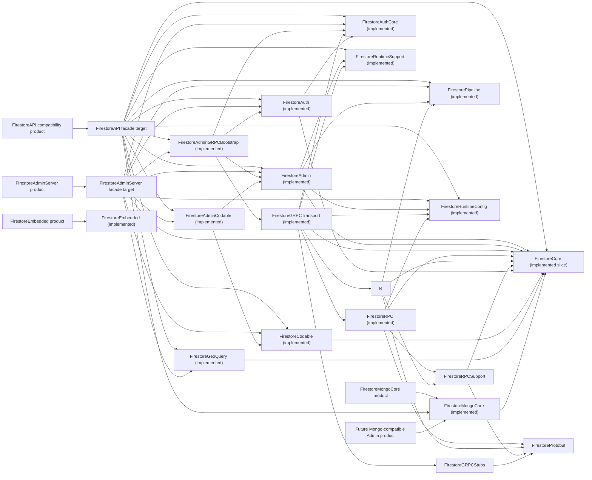

# Firestore Module Separation Plan

Status: Implemented; production live smoke pending credentials

Last reviewed: 2026-06-28

## Context

The package exposes four public library products. `FirestoreAdminServer` is the preferred server-side Admin product, `FirestoreEmbedded` is the explicit dependency-free Embedded Swift descriptor product, `FirestoreMongoCore` is the explicit MongoDB-compatible query-document product, and `FirestoreAPI` remains the compatibility all-in-one product for existing imports. Generated Firestore protobuf messages, generated gRPC stubs, authentication, the Core model layer, the dependency-free embedded descriptor layer, the server-side Admin facade, Admin Codable conveniences, Firestore Pipeline builders, native Firestore RPC translation, runtime support protocols, Codable conversion helpers, Native geohash GeoQuery helpers, Mongo-compatible query document builders, and grpc-swift transport runtime are separated into dedicated targets.

File-level responsibility boundaries are already present:

- Public Admin facade, server-side Admin builders, and narrow Admin dependency-injection protocols live in `Sources/FirestoreAdmin`.
- SDK-style Admin Codable convenience extensions live in `Sources/FirestoreAdminCodable` and are re-exported by `Sources/FirestoreAPI/FirestoreAdminCodableExports.swift`.
- gRPC-backed Admin construction convenience lives in `Sources/FirestoreAdminGRPCBootstrap`.
- The preferred server-side Admin import surface lives in `Sources/FirestoreAdminServer` and re-exports Admin, Admin Codable, gRPC bootstrap, Auth, Core, Codable, Pipeline, RuntimeConfig, and Native GeoQuery modules without re-exporting Mongo-compatible query documents, protobuf, gRPC stubs, RPC compilers, or concrete transport modules.
- Embedded Swift descriptors live in `Sources/FirestoreEmbedded`, are exposed as the explicit `FirestoreEmbedded` product, and do not depend on Core, Codable, protobuf, gRPC, Auth, Foundation, or transport modules.
- SDK-style references, collection groups, queries, snapshots, document value storage, runtime seams for reference/query operations, scalar values, database identity, field path, query filter/planning state, aggregation, Explain, source/listen option, snapshot metadata, path validation, and error values live in `Sources/FirestoreCore` and are re-exported by `Sources/FirestoreAPI/FirestoreCoreExports.swift`.
- Authentication provider contracts live in `Sources/FirestoreAuthCore` and are re-exported by `Sources/FirestoreAPI/FirestoreAuthCoreExports.swift`.
- Authentication credential providers live in `Sources/FirestoreAuth` and are re-exported by `Sources/FirestoreAPI/FirestoreAuthExports.swift`.
- Generated protobuf message files live in `Sources/FirestoreProtobuf/Proto`.
- Generated gRPC stub files live in `Sources/FirestoreGRPCStubs/Proto`.
- Pipeline builders and protobuf-free Pipeline result values live in `Sources/FirestorePipeline` and are re-exported by `Sources/FirestoreAPI/FirestorePipelineExports.swift`.
- Native RPC compilers and response mappers live in `Sources/FirestoreRPC`; listener reducers and listen request builders live in `Sources/FirestoreRPC/Listen`.
- Firestore Pipeline RPC compiler and response mapper live in `Sources/FirestorePipelineRPC`.
- Shared protobuf document decoding for RPC response mappers lives in `Sources/FirestoreRPCSupport`.
- Runtime configuration values for server settings, retry, logging, and authentication mode live in `Sources/FirestoreRuntimeConfig` and are re-exported by `Sources/FirestoreAPI/FirestoreRuntimeConfigExports.swift`.
- Runtime support protocols that compose public facade operations live in `Sources/FirestoreRuntimeSupport`.
- Codable conversion helpers and Firestore property wrappers live in `Sources/FirestoreCodable` and are re-exported by `Sources/FirestoreAPI/FirestoreCodableExports.swift`.
- Native geohash GeoQuery helpers live in `Sources/FirestoreGeoQuery` and are re-exported by `Sources/FirestoreAPI/FirestoreGeoQueryExports.swift`.
- Mongo-compatible query document builders live in `Sources/FirestoreMongoCore`, are exposed as the explicit `FirestoreMongoCore` product, and are re-exported by `Sources/FirestoreAPI/FirestoreMongoCoreExports.swift` only for compatibility.
- grpc-swift runtime code lives in `Sources/FirestoreGRPCTransport`.

The remaining problem is no longer generated output, Codable helpers, Admin Codable conveniences, Pipeline builders, Pipeline RPC translation, Native GeoQuery, Embedded Swift descriptors, Mongo-compatible query documents, low-level gRPC call execution, authentication contracts, gRPC-backed Admin construction, or Listen reducer code living directly beside public model values. Further reductions in cognitive cost should be conservative file-level splits inside existing targets unless a new concern brings a distinct dependency set. Future Mongo-compatible Admin facade and transport work remains a separate product/facade decision from day one.

## Proposed Target Graph

## Generated Visibility Contract

The proto regeneration script now writes generated files into separate package-internal targets and uses package-level generated visibility:

- `--swift_opt=Visibility=Package`
- `--grpc-swift-2_opt=Visibility=Package`

This is the correct boundary for package-internal implementation targets: `FirestoreRPC` and `FirestoreGRPCTransport` can consume generated symbols, while the public `FirestoreAdminServer` and `FirestoreAPI` products still avoid exposing protobuf or gRPC types.

`Visibility=Public` should not be the default migration path. It is only acceptable as a temporary fallback if a future generator regression blocks `Package`, and it must be paired with non-product generated targets plus symbol-graph checks proving that public product declarations do not expose generated types.

## Current Implementation Status

As of 2026-06-27, generated Firestore protobuf messages and generated gRPC stubs are split into package-internal, non-product SwiftPM targets:

- `FirestoreProtobuf` owns `Sources/FirestoreProtobuf/Proto/**/*.pb.swift`.
- `FirestoreGRPCStubs` owns `Sources/FirestoreGRPCStubs/Proto/**/*.grpc.swift`.
- `scripts/generate-firestore-protos.sh` regenerates both targets with `Visibility=Package` and removes stale generated output from `Sources/FirestoreAPI/Proto`.
- `FirestoreCore` owns `Database`, `DocumentReference`, `CollectionReference`, `CollectionGroup`, `Query`, `DocumentSnapshot`, `QueryDocumentSnapshot`, `QuerySnapshot`, `DocumentChange`, `QueryExplainResult`, package-only `FirestoreDocumentValue`, package-only reference/query runtime protocols, `Timestamp`, `GeoPoint`, `FirestoreVector`, `FirestoreVectorDistanceMeasure`, `FieldPath`, `FirestorePathValidator`, `FieldValue`, `Filter`, package-only `QueryPredicate`, `AggregateField`, `AggregateValue`, `AggregateQuerySnapshot`, `AggregateQueryExplainResult`, `FirestoreExplainOptions`, `FirestoreExplainValue`, `FirestoreExplainPlanSummary`, `FirestoreExplainExecutionStats`, `FirestoreExplainMetrics`, `FirestoreFindNearestQuery`, `FirestoreSource`, `ListenSource`, `SnapshotListenOptions`, `FirestoreSnapshotSequence`, `SnapshotMetadata`, `ServerTimestampBehavior`, `TransactionOptions`, and `FirestoreError`.
- `FirestoreRuntimeConfig` owns `FirestoreSettings`, `FirestoreRetryStrategy`, package-only retry execution helpers, `FirestoreLogLevel`, and `FirestoreAuthenticationMode`. It depends on `FirestoreCore` only for shared error values.
- `FirestoreAPI` re-exports `FirestoreCore` through `FirestoreCoreExports.swift` so current users still import only `FirestoreAPI`.
- `FirestoreAuthCore` owns `AccessTokenProvider`, `AccessScope`, and `FirestoreAccessScope`.
- `FirestoreAuth` owns service account credentials, service account OAuth token minting, metadata server token lookup, metadata server project ID lookup, and ADC resolution.
- `FirestorePipeline` owns `FirestorePipeline`, `PipelineStage`, `PipelineValue`, Pipeline options/enums, Pipeline query rows/snapshots, and Pipeline Explain result values.
- `FirestoreRPCSupport` owns shared protobuf document decoding for RPC response mappers.
- `FirestoreRPC` owns native Firestore request compilers, response mappers, listen target construction, listen stream coordination, and listen response reducers. It depends on `FirestoreCore`, `FirestoreRuntimeConfig`, `FirestoreRPCSupport`, and `FirestoreProtobuf`, but not Pipeline or grpc-swift transport modules.
- `FirestorePipelineRPC` owns Firestore Pipeline request compilation and ExecutePipeline response mapping. It depends on `FirestoreCore`, `FirestorePipeline`, `FirestoreRPCSupport`, and `FirestoreProtobuf`, but not Native `FirestoreRPC` or grpc-swift transport modules.
- `FirestoreRuntimeSupport` owns package-only batch and Pipeline runtime protocols plus the compatibility composition `FirestoreRuntime`.
- `FirestoreGRPCTransport` owns grpc-swift transport lifecycle, metadata construction, retry execution, generated client calls, and transport-specific error mapping. It depends on `FirestoreRuntimeConfig` for settings and retry policy and on `FirestoreAuthCore` token-provider contracts, not concrete credential providers.
- `FirestoreCodable` owns `FirestoreEncoder`, `FirestoreDecoder`, Firestore property wrappers, and Codable convenience extensions for references, queries, and snapshots.
- `FirestoreAdminCodable` owns SDK-style Codable convenience extensions for `FirestoreAdminWriteBatch`, `FirestoreAdminBulkWriter`, and `FirestoreAdminTransaction`. It depends on `FirestoreAdmin`, `FirestoreCodable`, and `FirestoreCore` so the Admin facade target does not directly depend on Codable conversion helpers.
- `FirestoreGeoQuery` owns Native Firestore geohash range planning, `FirestoreGeoHash`, exact Swift distance filtering, and `geoQuery(...)` convenience extensions.
- `FirestoreMongoCore` owns Mongo-compatible document values, GeoJSON point encoding, `$near` query document builders, and `2dsphere` index document builders. It depends on `FirestoreCore` only for shared value/error types and does not import Native RPC, Pipeline RPC, Native GeoQuery, protobuf, or grpc-swift modules.
- `FirestoreAdmin` owns `FirestoreAdmin`, narrow Admin client protocols, the compatibility `FirestoreAdminClient` composition, `FirestoreAdminWriteBatch`, `FirestoreAdminBulkWriter`, public `FirestoreAdminWriteOperation` summaries for fake/adaptor callbacks, `FirestoreAdminTransaction`, `FirestoreAdminWriteBuffer`, and `TransactionError`.
- `FirestoreAdminGRPCBootstrap` owns gRPC-backed `FirestoreAdmin` convenience construction, including service account, Application Default Credentials, emulator, custom access token provider, and grpc-swift transport runtime wiring.
- `FirestoreAdminServer` owns the preferred server-side Admin import surface. It re-exports Admin, Admin Codable, gRPC bootstrap, Auth, Core, Codable, Pipeline, RuntimeConfig, and Native GeoQuery modules, but does not re-export `FirestoreMongoCore`, `FirestoreRPC`, `FirestorePipelineRPC`, `FirestoreGRPCTransport`, `FirestoreProtobuf`, `FirestoreGRPCStubs`, or `FirestoreRuntimeSupport`.
- `FirestoreAPI` re-exports `FirestoreAdmin` through `FirestoreAdminExports.swift`, `FirestoreAdminCodable` through `FirestoreAdminCodableExports.swift`, and `FirestoreAdminGRPCBootstrap` through `FirestoreAdminGRPCBootstrapExports.swift` so current users still import only `FirestoreAPI`.
- `DocumentReference`, `CollectionReference`, `CollectionGroup`, `Query`, RPC response mappers, `FirestoreAdmin`, and `FirestoreGRPCTransportRuntime` hold or pass the narrowest capability they need instead of holding `any FirestoreRuntime`. Firestore Codable convenience lives in `Sources/FirestoreCodable/Cadable/*+Codable.swift`, keeping Core model files free of `FirestoreEncoder` and `FirestoreDecoder` calls. Admin Codable convenience lives in `Sources/FirestoreAdminCodable`, keeping the Admin facade target focused on server workflow behavior.

## Separation Candidates

| Priority | Candidate target | Status | Current files | Primary dependency boundary | Rationale |
|---|---|---|---|---|---|
| P0 | `FirestoreProtobuf` | Implemented | `Proto/**/*.pb.swift` | SwiftProtobuf only | Generated Firestore message types should be implementation details of RPC compilation and response mapping, not part of the conceptual Admin API module. |
| P0 | `FirestoreGRPCStubs` | Implemented | `Proto/**/*.grpc.swift` | GRPCCore, GRPCProtobuf, `FirestoreProtobuf` | Generated service clients are transport details. Keeping them out of core code clarifies that public references and queries do not call generated RPCs directly. |
| P0 | `FirestoreCore` | Expanded | database identity, reference/query/snapshot containers, document value storage, package-only reference/query runtime seams, scalar values, field paths, path validation, field sentinels, query filter/planning state, source/listen options, snapshot sequence, aggregation values/results, Explain values, vector query descriptor, transaction options, snapshot metadata, and error model | Foundation only | Core contains the user-facing SDK-compatible server Admin model without protobuf, gRPC, Logging, Crypto, or transport configuration dependencies. This creates the compile-time boundary required before moving RPC. |
| P0 | `FirestoreRuntimeConfig` | Implemented | `Sources/FirestoreRuntimeConfig/**` | `FirestoreCore` only | Server runtime settings, retry policy, log level, and authentication mode are shared by Admin bootstrap, transport, and Listen coordination, but they are not Firestore model/query state. Splitting them keeps `FirestoreCore` focused on Firestore values and runtime seams. |
| P0 | `FirestoreRPCSupport` | Implemented | `Sources/FirestoreRPCSupport/**` | `FirestoreCore`, `FirestoreProtobuf` | Shared protobuf document decoding is used by both Native RPC and Pipeline RPC response mappers without forcing either target to depend on the other. |
| P0 | `FirestoreRPC` | Implemented | `Sources/FirestoreRPC/**` | `FirestoreCore`, `FirestoreRuntimeConfig`, `FirestoreRPCSupport`, `FirestoreProtobuf`, SwiftProtobuf | Native Firestore request construction, response mapping, query validation, and listen reducers translate between public Admin values and Firestore RPC messages. It no longer owns Enterprise Pipeline RPC compilation. |
| P0 | `FirestorePipelineRPC` | Implemented | `Sources/FirestorePipelineRPC/**` | `FirestoreCore`, `FirestorePipeline`, `FirestoreRPCSupport`, `FirestoreProtobuf`, SwiftProtobuf | Enterprise Pipeline request construction and response mapping have a separate change surface from Native Query/Write/Listen RPC. |
| P0 | `FirestoreRuntimeSupport` | Implemented | `Sources/FirestoreRuntimeSupport/**` | `FirestoreCore`, `FirestorePipeline` | Facade composition and batch/Pipeline runtime seams are shared implementation contracts, not public API and not transport code. |
| P0 | `FirestoreGRPCTransport` | Implemented | `Sources/FirestoreGRPCTransport/**` | GRPCCore, GRPCNIOTransportHTTP2, Logging, `FirestoreRuntimeConfig`, `FirestoreRuntimeSupport`, `FirestoreRPC`, `FirestoreGRPCStubs`, `FirestoreAuthCore` | Transport lifecycle, metadata, retry execution, and generated client calls are isolated from request construction, credential provider implementations, and public API types. |
| P1 | `FirestoreEmbedded` | Implemented | `Sources/FirestoreEmbedded/**` | Swift standard library only | Embedded Swift consumers need Firestore-compatible value, reference, filter, and query descriptors without Foundation, Codable, protobuf, gRPC, Auth, or network execution dependencies. |
| P1 | `FirestoreAdmin` | Implemented | `Sources/FirestoreAdmin/FirestoreAdmin*.swift`, `Sources/FirestoreAdmin/TransactionError.swift` | `FirestoreCore`, `FirestorePipeline`, `FirestoreRuntimeSupport`, `FirestoreRuntimeConfig` | `FirestoreAPI` is now a compatibility import surface, not the owner of Admin workflow behavior. Admin has one reason to change: server-side Admin facade behavior. It no longer imports Auth, Codable conversion, or concrete gRPC transport modules. |
| P1 | `FirestoreAdminCodable` | Implemented | `Sources/FirestoreAdminCodable/**` | `FirestoreAdmin`, `FirestoreCodable`, `FirestoreCore` | SDK-style Codable Admin overloads are an adapter over Admin builders and Firestore Codable conversion, not core Admin workflow behavior. Splitting the target removes a non-essential dependency from `FirestoreAdmin` while preserving the single-import `FirestoreAPI` facade. |
| P1 | `FirestoreAuthCore` | Implemented | `Sources/FirestoreAuthCore/**` | Foundation only | Token provider contracts and Firestore OAuth scopes are shared by bootstrap and transport without forcing transport to depend on concrete credential provider code. |
| P1 | `FirestoreAuth` | Implemented | `Sources/FirestoreAuth/Auth/**`, `Sources/FirestoreAuth/FirestoreAuthCoreExports.swift` | `FirestoreAuthCore`, `FirestoreCore`, CryptoExtras, FoundationNetworking | Credential parsing, OAuth token minting, metadata token lookup, metadata project ID lookup, and ADC resolution have a separate lifecycle and dependency set. |
| P1 | `FirestoreCodable` | Implemented | `Sources/FirestoreCodable/**` | `FirestoreCore` | Codable conversion and property wrappers are SDK compatibility conveniences. Keeping them out of Core and the Admin facade lowers cognitive cost for query/RPC work. |
| P2 | `FirestorePipeline` | Implemented | `Sources/FirestorePipeline/**` except RPC mapper/compiler | `FirestoreCore` | Enterprise Pipeline is large and distinct from Core `Query`. The target boundary reduces cognitive load while the Admin facade still exposes Pipeline entry points. |
| P3 | `FirestoreGeoQuery` | Implemented | `Sources/FirestoreGeoQuery/**` | `FirestoreCore` | Native geohash GeoQuery is conceptually separate and must remain separate from Mongo-compatible geospatial APIs. |
| P2 | `FirestoreAdminGRPCBootstrap` | Implemented | `Sources/FirestoreAdminGRPCBootstrap/FirestoreAdmin+gRPC.swift` | `FirestoreAdmin`, `FirestoreAuthCore`, `FirestoreAuth`, `FirestoreCore`, `FirestoreRuntimeConfig`, `FirestoreGRPCTransport` | The Admin facade owns server-side user workflow behavior without also owning concrete credential-provider or grpc-swift bootstrap dependencies. The bootstrap target keeps source-compatible construction APIs available through `FirestoreAPI` while isolating authentication and gRPC transport setup. |
| P2 | `FirestoreAdminServer` | Implemented | `Sources/FirestoreAdminServer/**` | Admin, Auth, Core, Codable, Pipeline, RuntimeConfig, Native GeoQuery | The preferred server-side product should be narrower than the compatibility `FirestoreAPI` import. It excludes Mongo-compatible query documents and low-level RPC/transport implementation symbols from the re-exported public API surface while preserving one import for normal Admin applications. |
| P2 | `FirestoreMongoCore` | Implemented | `Sources/FirestoreMongoCore/**` | `FirestoreCore` | Mongo-compatible query documents, `$near`, `$geometry`, `2dsphere`, and GeoJSON semantics are a different API contract from Native Firestore `StructuredQuery`, geohash GeoQuery, and Pipeline `geo_distance`. |
| Future | `FirestoreMongo...` Admin facade and transport | Pending | none yet | Mongo-compatible transport and request execution | MongoDB-compatible request execution must remain a separate product/facade, not extensions on Native `QueryPredicate`, `FirestoreGeoQuery`, Pipeline helpers, or `FirestoreGRPCTransport`. |

## Completed File-Level Separations

| Owner | Current files | Rationale |
|---|---|---|
| `PipelineValue` | `PipelineValue.swift`, `PipelineValue+CoreExpressions.swift`, `PipelineValue+NumericComparison.swift`, `PipelineValue+Logic.swift`, `PipelineValue+Collections.swift`, `PipelineValue+Strings.swift`, `PipelineValue+Timestamps.swift`, and `PipelineValue+ReferenceVectorAggregation.swift` | `PipelineValue` keeps the stored expression representation and base factory methods, while helper APIs are grouped by expression family. This lowers scan cost without adding target or product complexity. |
| `PipelineCompiler` | `Sources/FirestorePipelineRPC/PipelineCompiler.swift`, `PipelineCompiler+Pipeline.swift`, `PipelineCompiler+Value.swift`, `PipelineCompiler+FunctionValidation.swift`, `PipelineCompiler+StageValidation.swift`, `PipelineCompiler+StageArgumentValidation.swift`, `PipelineCompiler+StageOrderValidation.swift`, `PipelineCompiler+StageValidationHelpers.swift`, `PipelineCompiler+VectorStageValidation.swift`, and `PipelineCompiler+Explain.swift` | The compiler entry point, protobuf Pipeline construction, value encoding, function validation, known stage dispatch, stage argument shape validation, stage ordering rules, shared stage validation helpers, vector nearest validation, and Explain option encoding now have separate reading paths inside the dedicated `FirestorePipelineRPC` target. |
| `QueryCompiler` | `QueryCompiler.swift`, `QueryCompiler+Aggregation.swift`, `QueryCompiler+Cursor.swift`, `QueryCompiler+Vector.swift`, and `QueryCompiler+Explain.swift` | Structured query planning remains in the compiler entry point, while Core aggregation request construction, cursor/reference cursor encoding, vector `findNearest` encoding, and query Explain option encoding now have separate reading paths inside `FirestoreRPC`. |
| `FirestoreValueEncoder` | `FirestoreValueEncoder.swift`, `FirestoreValueEncoder+Validation.swift`, `FirestoreValueEncoder+Value.swift`, and `FirestoreValueEncoder+Vector.swift` | Package entry points remain in the base file, while SDK-compatible value validation, protobuf value construction, and vector validation/encoding now have separate reading paths inside `FirestoreRPC`. |
| `QueryConstraintValidator` | `QueryConstraintValidator.swift` and `QueryPredicateAnalyzer.swift` | DNF predicate analysis and tracked query statistics now live separately from Firestore constraint rule enforcement. The validator reads as policy checks, while the analyzer owns predicate-tree normalization into disjunction terms and stats. |
| `FirestoreCodable` containers | `FirestoreEncoder.swift`, `FirestoreKeyedEncodingContainer.swift`, `FirestoreUnkeyedEncodingContainer.swift`, `FirestoreSingleValueEncodingContainer.swift`, `FirestoreDecoder.swift`, `FirestoreDecoderSupport.swift`, `FirestoreKeyedDecodingContainer.swift`, `FirestoreUnkeyedDecodingContainer.swift`, and `FirestoreSingleValueDecodingContainer.swift` | Public encoder/decoder entry points are separate from keyed, unkeyed, single-value, special-value, missing-value, and numeric conversion behavior. This keeps Codable compatibility work localized without adding another target. |
| `ReadResponseMapper` | `ReadResponseMapper.swift`, `ReadResponseMapper+Documents.swift`, `ReadResponseMapper+Aggregation.swift`, and `ReadResponseMapper+Explain.swift` | Finite read response mapping now has separate paths for document/query snapshots, collection/document references, aggregation snapshots, and Explain metrics/results while remaining in the protobuf translation layer. |
| Listen reducers and builders | `Sources/FirestoreRPC/Listen/DocumentListenState.swift`, `QueryListenState.swift`, `QueryListenState+Storage.swift`, `QueryListenState+Ordering.swift`, `QueryListenState+Snapshot.swift`, `QueryListenState+Validation.swift`, `ListenTargetBuilder.swift`, `ListenRequestStreamController.swift`, and `ListenStreamCoordinator.swift` | Listen request builders, request-stream buffering, reducer state, query-result ordering, snapshot emission, existence-filter validation, and reconnect/resync coordination now have a dedicated folder-level reading path inside `FirestoreRPC`. This keeps stream reducer work distinct from finite query/write request compilation without adding another SwiftPM target. |
| Aggregation transport wrappers | `FirestoreGRPCRuntime+Aggregation.swift` | Core aggregation and aggregation Explain wrappers live beside the `RunAggregationQuery` transport implementation, not in collection-reference pagination code. This keeps `FirestoreGRPCRuntime+CollectionOperations.swift` focused on `ListCollectionIds` and `ListDocuments`. |
| Admin client protocols and write summaries | `FirestoreAdminReferenceClient.swift`, `FirestoreAdminWriteClient.swift`, `FirestoreAdminTransactionClient.swift`, `FirestoreAdminPipelineClient.swift`, `FirestoreAdminLifecycleClient.swift`, `FirestoreAdminClient.swift`, and `FirestoreAdminWriteOperation.swift` | Server-side consumers can depend on the narrowest workflow surface while `FirestoreAdminClient` remains a source-compatible full-surface composition. Public fake/adaptor clients can return write builders and inspect buffered write summaries without importing protobuf, grpc-swift, or package-only `WriteData`. |
| Admin Codable conveniences | `Sources/FirestoreAdminCodable/FirestoreAdminWriteBatch+Codable.swift`, `FirestoreAdminBulkWriter+Codable.swift`, and `FirestoreAdminTransaction+Codable.swift` | Admin dictionary writes, transaction control, and write staging remain readable without `FirestoreEncoder`/`FirestoreDecoder` noise. SDK-style Codable aliases are now target-separated from `FirestoreAdmin` and remain source-compatible through the `FirestoreAPI` facade re-export. |
| gRPC runtime operation files | `FirestoreGRPCRuntime+DocumentOperations.swift`, `FirestoreGRPCRuntime+CollectionOperations.swift`, and `FirestoreGRPCRuntime+QueryOperations.swift` | Transport operation files are named for the runtime owner and operation family rather than public model types. This avoids implying that public references own gRPC behavior. |
| gRPC finite RPC execution policy | `FirestoreGRPCRuntime+Execution.swift`, `FirestoreGRPCRuntime+Authorization.swift`, `FirestoreGRPCRuntime+FiniteRequest.swift`, `FirestoreRPCExecutor.swift`, and `FirestoreRetryableOperation.swift` | Timeout call options, access token metadata, finite `ClientRequest` construction, retry policy selection, and RPC error mapping are separate reading paths. Finite RPC operation files call `executeFiniteRPC(message:_:)` or `executeFiniteRPCWithoutAutomaticRetry(message:_:)`, which build a fresh request inside each retry attempt. Listen keeps streaming request construction in `FirestoreListenStreamExecutor`. |

## Remaining File-Level Separation Candidates

The target graph is now useful enough that the next reductions in cognitive load should mostly be file-level separations inside existing targets, not new SwiftPM targets.

| Priority | Current owner | Suggested split | Target change | Rationale |
|---|---|---|---|---|
| P3 | Listen target-change/error helper | Consider extracting a shared helper only if `DocumentListenState` and `QueryListenState` begin duplicating target-change cause handling or resume-token policy beyond the current small branches. | No target change | Listen now has a dedicated folder-level reading path. A helper target or type should wait until duplication appears, because the current reducer files remain small enough to read directly. |
| Future | Mongo-compatible Firestore transport | Create a separate Mongo-compatible facade and transport owner. | Add a separate target or product | Query document builders now live in `FirestoreMongoCore`; request execution still needs a separate transport because Mongo-compatible wire/API behavior is not the Firestore v1 gRPC transport. |

## Target Split Decision Matrix

| Candidate | Split into SwiftPM target now? | Decision |
|---|---:|---|
| Admin gRPC bootstrap | Split completed | It has a distinct dependency reason: concrete grpc-swift transport construction. Keeping this separate from `FirestoreAdmin` makes the Admin facade easier to understand and keeps future transport owners from editing the Admin facade target. |
| Admin Codable conveniences | Split completed | It has a distinct dependency reason: `FirestoreCodable`. Keeping this separate from `FirestoreAdmin` makes the Admin facade readable as server workflow code while preserving SDK-style typed write/read overloads through `FirestoreAPI`. |
| Runtime configuration | Split completed | `FirestoreSettings`, retry policy, log level, and authentication mode are server runtime configuration shared by bootstrap, transport, and Listen coordination. Keeping them out of `FirestoreCore` makes Core easier to scan as Firestore model/query/snapshot code. |
| Auth provider contracts | Split completed | `FirestoreGRPCTransport` only needs `AccessTokenProvider`, `AccessScope`, and Firestore scopes. `FirestoreAuthCore` keeps those contracts separate from service account, ADC, metadata server, Crypto, and networking implementation details. |
| Pipeline RPC translation | Split completed | `FirestorePipelineRPC` owns Enterprise Pipeline compiler and mapper code. Native `FirestoreRPC` no longer depends on Pipeline builders, and Pipeline RPC does not depend on Native query/write/listen compilers. |
| Query compiler internals | Not yet | These pieces all translate Native Firestore values to Firestore v1 protobuf. File splits are enough unless another target needs to reuse only one compiler family. |
| Value encoding internals | Not yet | The encoder is protobuf-specific and belongs in `FirestoreRPC`; split files or helper structs before adding target complexity. |
| Listen reducer internals | Folder/file split completed | Listen state is a coherent RPC reducer family. A subfolder and focused `QueryListenState` extension files are sufficient unless a non-gRPC transport reuses the same reducer without the rest of `FirestoreRPC`. |
| Mongo-compatible query documents | Split completed | `FirestoreMongoCore` owns query documents, GeoJSON points, `$near`, and `2dsphere` declarations. Future request execution should not grow inside Native Query, Native GeoQuery, Pipeline, or `FirestoreGRPCTransport`. |

## Non-Goals

- Do not expose generated protobuf or gRPC modules as public package products.
- Do not move Mongo-compatible query concepts into Native Firestore modules.
- Do not split every small value type into its own target. Excessive module count would raise build and navigation cost.
- Do not make public API depend on `package` or generated types.

## Migration Sequence

1. Completed: switch proto regeneration to `Visibility=Package` for both SwiftProtobuf and grpc-swift generated output, then regenerate.
2. Completed: create `FirestoreProtobuf` and move `.pb.swift` generated output there as a non-product target.
3. Completed: create `FirestoreGRPCStubs` and move `.grpc.swift` generated output there as a non-product target.
4. Completed: create `FirestoreCore`, move protobuf-free database identity, scalar/error, path validation, field path, query filter/planning state, aggregation, Explain, source/listen option, snapshot metadata, transaction option, reference, query, snapshot, document value storage, and reference/query runtime seam values there, and re-export it from `FirestoreAPI`.
5. Completed for the model and Admin seams: `FirestoreRuntime` remains as a compatibility composition for shared fake/gRPC runtime conformance, while reference/query-facing code, `FirestoreAdmin`, and transport bootstrap data depend on narrower package-only capability protocols.
6. Completed: move native RPC compilers, response mappers, listener reducers, and listen coordination into `FirestoreRPC`, keeping cross-target seams at package visibility.
7. Completed: move grpc-swift transport runtime into `FirestoreGRPCTransport`.
8. Completed: move token provider contracts into `FirestoreAuthCore`, credential providers into `FirestoreAuth`, then re-export both through the `FirestoreAPI` facade.
9. Keep `FirestoreAPI` as the compatibility product and facade import surface. Use package-level initializers for seams that must cross internal targets.
10. Completed: move Pipeline builders and Pipeline result values into `FirestorePipeline`, then re-export them from `FirestoreAPI`.
11. Completed: move Codable conversion helpers and property wrappers into `FirestoreCodable`, then re-export them from `FirestoreAPI`.
12. Completed: move Native geohash GeoQuery helpers into `FirestoreGeoQuery`, then re-export them from `FirestoreAPI`.
13. Completed: create a `FirestoreAdmin` target for the public server-side Admin facade, then make `FirestoreAPI` re-export `FirestoreAdmin` plus compatibility modules. Existing `FirestoreAPI` product imports remain source-compatible.
14. Completed: move gRPC-backed Admin construction into `FirestoreAdminGRPCBootstrap`, then re-export it from `FirestoreAPI`. `FirestoreAdmin` no longer depends on `FirestoreAuth` or `FirestoreGRPCTransport`.
15. Completed: create `FirestoreRPCSupport` for shared protobuf document decoding used by Native RPC and Pipeline RPC response mappers.
16. Completed: create `FirestorePipelineRPC`, move Pipeline compiler/mapper files there, and make `FirestoreGRPCTransport` depend on it explicitly for `ExecutePipeline`.
17. Completed: move Listen reducers/builders/coordinator into `Sources/FirestoreRPC/Listen/` and split `QueryListenState` by storage, ordering, snapshot, and validation responsibilities.
18. Completed: split public Admin dependency-injection contracts into focused reference, write, transaction, Pipeline, and lifecycle protocols while keeping `FirestoreAdminClient` as the compatibility composition.
19. Completed: split gRPC finite RPC execution support into authorization metadata, finite request construction, retryable operation mapping, and executor policy files. Finite RPC retry helpers now construct request metadata per attempt rather than reusing metadata captured before retry execution.
20. Completed: add public Admin write-builder factories and `FirestoreAdminWriteOperation` summaries so external fake/adaptor clients can implement `FirestoreAdminWriteClient` without depending on package-only `WriteData`.
21. Completed: move Admin write-batch, bulk-writer, and transaction Codable convenience methods into dedicated extension files while keeping dictionary writes and transaction state control in the base files.
22. Completed: move aggregation transport wrappers out of collection-reference pagination code and into `FirestoreGRPCRuntime+Aggregation.swift`.
23. Completed: rename gRPC transport operation files from public model names to `FirestoreGRPCRuntime+...Operations.swift`.
24. Completed: create `FirestoreMongoCore` for Mongo-compatible GeoJSON `$near` query documents and `2dsphere` index declarations, then re-export it from `FirestoreAPI`.
25. Completed: create `FirestoreAdminCodable`, move Admin Codable convenience extensions there, remove the direct `FirestoreCodable` dependency from `FirestoreAdmin`, and re-export the target from `FirestoreAPI`.
26. Completed: create `FirestoreRuntimeConfig`, move `FirestoreSettings`, retry policy/execution helpers, log level, and authentication mode there, remove those server-runtime configuration types from `FirestoreCore`, and re-export the target from `FirestoreAPI`.
27. Completed: create `FirestoreAdminServer` as the preferred server-side Admin product that excludes Mongo-compatible query documents and low-level RPC/transport modules from its re-export surface.

## Required Gates After Each Step

- `swift build --configuration debug`
- `perl -e 'alarm shift; exec @ARGV' 120 xcodebuild -scheme FirebaseAPI-Package -destination 'platform=macOS' test -only-testing:FirebaseAPITests/ServerSideAPISafetyTests -quiet`
- `bash scripts/check-release-readiness.sh`
- Public symbol graph must not expose protobuf, grpc-swift transport, or internal query-planning symbols.
- Native Query, GeoQuery, and Pipeline source must remain free of Mongo-compatible `$near`, `2dsphere`, BSON, and GeoJSON query-builder concepts; those concepts belong in `FirestoreMongoCore` until a future Mongo-compatible transport target exists.

## Expected Developer Benefit

| Before | After |
|---|---|
| One large target contains public API, auth, generated code, RPC planning, and transport. | Each target has one reason to change: public model, auth, protobuf, RPC translation, or transport. |
| Boundary violations are mostly caught by tests and symbol graph checks. | Many boundary violations become compile-time import errors. |
| Contributors must mentally filter generated code and transport details while reading public API. | Contributors can start in `FirestoreCore` or `FirestoreAdmin` and follow explicit target dependencies only when needed. |
