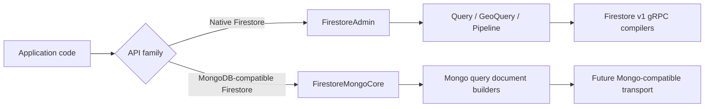

# Firestore Mongo-Compatible Responsibility Boundary

Status: Initial boundary implemented

Last reviewed: 2026-06-27

## Context

Firestore Native mode and Firestore Enterprise MongoDB-compatible mode share the Firestore product name, but they do not share the same query language, index model, or request contract.

Native Firestore Admin code in this package is built around Firestore v1 gRPC requests such as `StructuredQuery`, `RunQuery`, `Commit`, `Listen`, and `ExecutePipeline`. MongoDB-compatible geospatial queries use MongoDB-compatible query documents, `2dsphere` indexes, and `$near`/GeoJSON semantics. These concepts must not be added to Native `QueryPredicate`, Native GeoQuery, or Firestore Pipeline expression helpers. Firestore Pipeline geospatial search uses the Native Pipeline `geo_distance` function instead; it is not MongoDB-compatible `$near` support.

Official reference:

- [Firestore Enterprise MongoDB-compatible geo queries](https://firebase.google.com/docs/firestore/enterprise/geo-query-mongodb)

## Decision

MongoDB-compatible Firestore APIs are implemented through a separate boundary, not as extensions on Native Firestore query types. `FirestoreMongoCore` is the first boundary: it owns Mongo query document builders for GeoJSON points, `$near` documents, and `2dsphere` index declarations. A full `FirestoreMongoAdminClient` and Future Mongo-compatible transport remain separate follow-up work.

## Ownership

| Concern | Native Firestore Admin | Mongo-compatible Admin |
|---|---|---|
| Public entry point | `FirestoreAdmin` | `FirestoreMongoCore` query-document builders re-exported by `FirestoreAPI`; future `FirestoreMongoAdminClient` or separate SwiftPM product |
| Query representation | Typed Swift query builders compiled to Firestore v1 protobuf | BSON-like query documents represented by `FirestoreMongoDocument` and `FirestoreMongoValue` |
| Geospatial API | `FirestoreGeoQuery` with geohash ranges and exact Swift distance filtering; Firestore Pipeline `geo_distance` expressions in Pipeline Search | `FirestoreMongoGeoNearQuery`, `$near`, `$geometry`, GeoJSON points, and `FirestoreMongoGeoIndex` `2dsphere` declarations |
| Index model | Firestore single-field and composite indexes | Mongo-compatible geospatial indexes |
| Transport owner | `FirestoreGRPCTransport` | Future Mongo-compatible transport owner |
| Shared types | `GeoPoint` may be reused as a value type | Query predicates, index declarations, and request compilers are not shared |

## Native API Restrictions

Native Firestore source must keep these concepts out of public query APIs:

- `$near`
- `2dsphere`
- GeoJSON query documents
- BSON request builders
- MongoDB-compatible index declarations

The only Core Native query geospatial contract is the geohash solution: store a geohash string and a `GeoPoint`, issue Firestore range queries over the geohash, then filter by exact distance in Swift. Enterprise Native Pipeline geospatial search remains separate and uses `PipelineValue.geoDistance(to:)` inside Pipeline `search` expressions.

## Implemented Boundary and Future Shape

The current boundary is `FirestoreMongoCore`. It introduces query-document values and geospatial request/index builders without importing Native RPC compilers, Native geohash GeoQuery, Pipeline RPC compilers, protobuf, or grpc-swift transport modules.

The boundary must preserve these dependency rules:

- It should not call `QueryCompiler`.
- It should not call `QueryPredicateFilterCompiler`.
- It should not call `PipelineCompiler`.
- It should not call `FirestoreGeoQuery`.

Current implementation gates:

- `FirestoreMongoGeoJSONPoint` validates longitude and latitude and emits GeoJSON coordinate order.
- `FirestoreMongoGeoNearQuery` emits `$near`, `$geometry`, `$maxDistance`, and `$minDistance` query documents.
- `FirestoreMongoGeoIndex` emits `2dsphere` index documents.
- Tests prove `$near` and `2dsphere` support do not modify Native `QueryPredicate`, Native `FirestoreGeoQuery`, or Pipeline source.

Future implementation gates:

- A dedicated public entry point for Mongo-compatible Firestore.
- A separate request compiler for Mongo-compatible query documents.
- A separate transport owner for Mongo-compatible requests.
- Tests proving Native `geoQuery(...)` still emits geohash range queries, not Mongo-compatible geospatial requests.
- Documentation showing which Firestore Enterprise configuration is required before Mongo-compatible APIs can be used.
