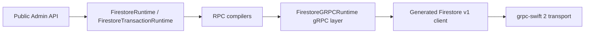

# Firestore RPC Implementation Audit

Status: Accepted

Last reviewed: 2026-06-27

## Scope

This audit covers the hand-written Firestore gRPC layer after regenerating Firestore v1 protobufs from the `goolgeapis` submodule at `256f0860cc8a4ae2e5f4f606ce7915fd10b5e5e7`.
The fetched `goolgeapis` `origin/master` is `21ebf267616ce5544deb088c6f8afb84271cf30c`; there is no `google/firestore/v1` proto diff between that revision and the checked out submodule revision.

The primary sources used for this audit are:

- `goolgeapis/google/firestore/v1/firestore.proto`
- `goolgeapis/google/firestore/v1/common.proto`
- `Sources/FirestoreAPI/Proto/google/firestore/v1/firestore.grpc.swift`
- `grpc-swift-2` local package sources under `.build/checkouts`

## Boundary

Only the gRPC layer may construct `ClientRequest` and `StreamingClientRequest`. Public Admin types and runtime protocol conformance do not construct protobuf requests directly.

Service account JSON is loaded at the Admin/auth boundary. `ServiceAccountCredentials` exposes project and service account identity metadata for Admin setup, while private key material and token endpoint details are consumed by `ServiceAccountAccessTokenProvider` and are not public credential state.

## RPC Matrix

| Public operation | Firestore RPC | Request owner | Response owner | Retry policy | Timeout policy |
|---|---|---|---|---|---|
| `DocumentReference.getDocument()` | `GetDocument` | `DocumentRequestCompiler` | `ReadResponseMapper` | Retry remote deadline/resource/unavailable errors | Uses `CallOptions.timeout` |
| `DocumentReference.setData`, `updateData`, `delete` | `Commit` | `WriteCompiler` | Commit success check | No automatic retry | Uses `CallOptions.timeout` |
| `DocumentReference.listCollections()` | `ListCollectionIds` | `DocumentRequestCompiler` | `ReadResponseMapper` plus gRPC page accumulation | Retry remote deadline/resource/unavailable errors per page | Uses `CallOptions.timeout` |
| `CollectionReference.listDocuments()` | `ListDocuments` | `DocumentRequestCompiler` | `ReadResponseMapper` plus gRPC page accumulation | Retry remote deadline/resource/unavailable errors per page | Uses `CallOptions.timeout` |
| `FirestoreAdminWriteBatch.commit()` | `Commit` | `WriteCompiler` | Commit success check | No automatic retry | Uses `CallOptions.timeout` |
| `FirestoreAdminBulkWriter.flush()` | `BatchWrite` | `BatchWriteCompiler` | `BatchWriteResponseMapper` into per-write status values | Retry remote deadline/resource/unavailable errors; per-write failures are returned in the result | Uses `CallOptions.timeout` |
| Transaction read document | `BatchGetDocuments` | `DocumentRequestCompiler` | `ReadResponseMapper` | Retry remote deadline/resource/unavailable errors | Uses `CallOptions.timeout` |
| Transaction query read | `RunQuery` | `QueryCompiler` | `ReadResponseMapper` | Retry remote deadline/resource/unavailable errors | Uses `CallOptions.timeout` |
| Transaction begin | `BeginTransaction` | `TransactionRequestCompiler` | Transaction ID | Retry remote deadline/resource/unavailable errors | Uses `CallOptions.timeout` |
| Transaction commit | `Commit` | `WriteCompiler` | Commit success check | Transaction runner retries only `ABORTED`; the next `BeginTransaction` passes the prior ID as `retry_transaction` | Uses `CallOptions.timeout` |
| Transaction rollback | `Rollback` | `TransactionRequestCompiler` | Empty response | Retry remote deadline/resource/unavailable errors | Uses `CallOptions.timeout` |
| Query get documents and vector nearest search | `RunQuery` | `QueryCompiler` | `ReadResponseMapper` | Retry remote deadline/resource/unavailable errors | Uses `CallOptions.timeout` |
| Core aggregation (`count`, `sum`, `average`) | `RunAggregationQuery` | `QueryCompiler` | `ReadResponseMapper` into `AggregateQuerySnapshot` | Retry remote deadline/resource/unavailable errors | Uses `CallOptions.timeout` |
| Collection group partition planning | `PartitionQuery` | `PartitionQueryCompiler` | `PartitionQueryResponseMapper` into executable `Query` ranges | Retry remote deadline/resource/unavailable errors per page | Uses `CallOptions.timeout` |
| Query Explain | `RunQuery` / `RunAggregationQuery` | `QueryCompiler` | `ReadResponseMapper` into protobuf-free explain result values | Retry remote deadline/resource/unavailable errors | Uses `CallOptions.timeout` |
| Firestore Pipeline operations and subqueries | `ExecutePipeline` | `PipelineCompiler` | `PipelineResponseMapper` into pipeline rows | Retry remote deadline/resource/unavailable errors | Uses `CallOptions.timeout` |
| Pipeline Explain | `ExecutePipeline` | `PipelineCompiler` structured pipeline options | `PipelineResponseMapper` into protobuf-free pipeline explain stats | Retry remote deadline/resource/unavailable errors | Uses `CallOptions.timeout` |
| Snapshot listener | `Listen` | `ListenRequestBuilder` and `ListenTargetBuilder` | `DocumentListenState` / `QueryListenState` | Reconnect retry with resume token; full resync on existence filter mismatch | No finite call timeout; stream lifetime is caller-controlled |

## Decisions

### Generated Client Methods

The generated Firestore client already provides convenience methods with the correct protobuf serializer and deserializer for each RPC. Hand-written source must call those generated methods directly and must not duplicate `ProtobufSerializer` or `ProtobufDeserializer` setup. This keeps the hand-written RPC layer aligned with regenerated stubs.

### Commit Retry

`Commit` is intentionally not wrapped in the generic retry handler. If a commit reaches the server and the client loses the response, blindly retrying can duplicate non-idempotent writes such as transforms. Transaction retries are handled at the transaction level by retrying `ABORTED` with a new transaction flow.

### BatchWrite Bulk Semantics

`BatchWrite` is exposed only through `FirestoreAdminBulkWriter`, not through `FirestoreAdminWriteBatch`. It is non-atomic, does not guarantee ordering, and returns per-write statuses. Duplicate document targets in one flush are rejected before RPC, and protobuf `Status` / `WriteResult` values are mapped into `FirestoreBulkWriteResult` rather than leaking through the public API.

### Low-level Write RPC Boundary

Low-level Firestore write RPCs are not public API. Hand-written gRPC source must not call generated `createDocument`, `updateDocument`, `deleteDocument`, or `write` methods. Individual document writes, atomic batches, and transactions must compile through `WriteCompiler` to `Commit`; non-atomic bulk writes must compile through `BatchWriteCompiler` to `BatchWrite`.

`CreateDocument`, `UpdateDocument`, and `DeleteDocument` duplicate write mask, transform, and precondition concerns already owned by `WriteCompiler`. The streaming `Write` RPC is a transport primitive for client SDK write streams and local pending-write behavior. This server-side Admin surface exposes awaited finite writes instead: `Commit` for atomic operations and `BatchWrite` for non-atomic bulk operations.

### Read Source Options

SDK-style `FirestoreSource` read options are handled at the public facade boundary. `.default` and `.server` dispatch to the same finite server RPCs, while `FirestoreSource.cache` is rejected before runtime dispatch because server-side Admin has no local cache. The gRPC runtime receives the same compiled `GetDocument` or `RunQuery` request for accepted sources.

### Snapshot Field Lookup

SDK-style `DocumentSnapshot.get(...)`, `QueryDocumentSnapshot.get(...)`, snapshot subscripts, and `data(with:)` are pure snapshot facade operations. They read already-decoded `FirestoreDocumentValue` fields, normalize string field paths with core `FirestoreFieldPath`, and do not construct protobuf requests or call the runtime. Reference and query identity values such as document IDs, collection IDs, and collection-group IDs are immutable after construction; query builder methods return new `Query` values instead of mutating a runtime-bound source. Snapshot result state, `Timestamp`, and `GeoPoint` are immutable public values so app code cannot mutate already-mapped server results into states the runtime never observed. `QueryDocumentSnapshot.data()` is non-optional because query results contain existing documents. `ServerTimestampBehavior` is accepted for source compatibility; server-side Admin reads only synchronized server values, so the behavior does not change returned data.

### Transaction Retry

Read-write transaction retries pass the prior transaction ID through `TransactionOptions.ReadWrite.retry_transaction` on the next `BeginTransaction` request. Read-only transactions do not pass `retry_transaction`, because the proto field belongs to `ReadWrite`.

### Listen Authentication

Listen reconnects must refresh authorization metadata. Long-lived server processes can outlive OAuth access tokens, so each stream open calls `authorizedMetadata()` rather than reusing metadata captured when the public listener was created.

### Finite RPC Request Metadata

Finite unary/server-streaming calls execute through `executeFiniteRPC(message:_:)` or `executeFiniteRPCWithoutAutomaticRetry(message:_:)`. These helpers build a fresh `ClientRequest` through `makeFiniteRPCRequest(message:)` inside the retry operation, so authorization metadata is refreshed for each attempt and for each pagination request. Finite operation files keep their focus on request compilation, generated client method selection, timeout call options, retry policy choice, and response mapping; they do not construct `ClientRequest` or call the retry executor directly. Listen uses the separate streaming request executor because long-lived streams have different termination and reconnect behavior.

SDK-style `SnapshotListenOptions` are handled at the public facade boundary. `DocumentReference.snapshots`, `CollectionReference.snapshots`, `CollectionGroup.snapshots`, `Query.snapshots`, and `snapshots(options:)` are the canonical server-side listener API; `addSnapshotListener(...)` remains a compatibility alias over the same stream creation path. Collection and collection-group listeners forward through `Query`, preserving collection-group `allDescendants` semantics before RPC compilation. `includeMetadataChanges` is accepted for source compatibility while server snapshots remain `SnapshotMetadata.serverSynchronized`; `ListenSource.cache` is rejected before runtime dispatch because server-side Admin has no local cache. The gRPC runtime receives the same compiled Listen target for accepted options.

### Listen Cancellation

The user-facing `FirestoreSnapshotSequence` lazily opens the underlying `AsyncThrowingStream` when iteration starts. The stream cancels the coordinator task when the consumer stops iterating. `FirestoreListenStreamExecutor` owns the gRPC request stream termination path and gRPC `RPCError` mapping: it sends a remove-target request through `ListenRequestStreamController`, maps transport errors into `FirestoreError`, and then finishes the local request channel. `ListenStreamCoordinator` consumes protobuf Listen responses and `FirestoreError` values only, so reconnect and full-resync control stays independent of grpc-swift transport types.

### Listen Timeout

`FirestoreSettings.timeout` is an RPC deadline for finite calls. It is not applied to `Listen`, because Listen is a long-lived bidirectional stream. Listen cancellation is controlled by ending iteration of the returned `FirestoreSnapshotSequence` or underlying `AsyncThrowingStream`.

### Retry Duration

Finite RPC retry wrappers use `FirestoreSettings.timeout` as their maximum retry duration. The value must not be hard-coded in the gRPC layer.

### Aggregation Responses

`RunAggregationQueryResponse.result` may be absent on progress-only responses. The aggregation reader ignores responses without `result` and returns the first actual aggregation result. Core aggregation supports Firestore's current `count`, `sum`, and `average` operators, normalizes SDK-style string field paths before request construction, preserves integer and double sum results, and represents empty average results as `AggregateValue.null`. `AggregateField` exposes factory methods for user code while its operation, field path, and alias representation remain compiler-owned. `CollectionReference.aggregate(_:)` and `CollectionGroup.aggregate(_:)` forward through `Query.aggregate(_:)`; `CollectionReference.count()` and `CollectionGroup.count()` forward through `Query.count()` so Core aggregation has one `RunAggregationQuery` compiler and runtime path.

### Vector Search

Core vector nearest-neighbor search is exposed as `Query.findNearest(...)` and compiled by `QueryCompiler` to `StructuredQuery.FindNearest`. Public API types use `FirestoreVector` and `FirestoreVectorDistanceMeasure`; protobuf `Value`, `FieldReference`, `Int32Value`, and generated distance-measure enums remain internal RPC details. The compiler validates the vector field path, optional distance result document field name, the 2,048-dimension query-vector limit, and the 1,000-result nearest-neighbor limit.

Firestore data writes can store `FirestoreVector` values through `FirestoreValueEncoder`, which emits Firestore `Value.array_value` because the current generated Firestore v1 `Value` protobuf has no public `vector_value` field. `FieldValue.delete()` and `FieldValue.serverTimestamp()` provide SDK-style sentinel factories while preserving the existing sentinel values during the Admin API transition. `FieldValue.vector(...)` is a public SDK-style helper that returns this server-side `FirestoreVector` value. `FirestoreEncoder` treats `FirestoreVector`, `Data`, and `FieldValue` as passthrough values so Codable models do not accidentally encode Firestore-specific values as keyed structs or byte arrays. RPC document decoding maps Firestore `bytes_value` to `Data` and array values to arrays; `FirestoreDecoder` then restores a raw numeric array into `FirestoreVector` when the user model requests that type. `@ServerTimestamp` encodes nil Codable timestamp fields as `FieldValue.serverTimestamp()`; `WriteCompiler` then turns that sentinel into `Commit.update_transforms`. On reads, `@ServerTimestamp` and `@ExplicitNull` decode missing or null fields as nil so property-wrapper storage does not turn optional Firestore fields into required Codable keys. `FieldValue.increment(Int/Int64)` is encoded as an integer increment transform and `FieldValue.increment(Double)` is encoded as a double increment transform, preserving Firestore `Value` numeric type intent before `Commit.update_transforms` construction. `WriteCompiler` owns Commit preconditions: create writes encode `current_document.exists == false`, update writes encode `current_document.exists == true`, and ordinary set/merge writes omit create/update existence preconditions. Literal document data keys and write mask field paths are validated against Firestore document field name rules before `Commit` request construction, while Query and Pipeline field references continue to allow documented `__name__` reference usage. `updateData` field paths and explicit `mergeFields` reject duplicate or parent/child-conflicting paths before request construction. Explicit `mergeFields` writes validate that each requested field path has a corresponding value in the input data and suppress transforms outside the requested merge field coverage before constructing `Commit.update_transforms`.

`DocumentSnapshot.data(as:)`, `QueryDocumentSnapshot.data(as:)`, and `QuerySnapshot.documents(as:)` are the public typed decode entry points for already-fetched snapshots. They delegate to `FirestoreDecoder` with each snapshot's `DocumentReference`, so property wrappers such as `@DocumentID` are resolved without exposing RPC document fields or protobuf values to application code.

### Query Explain

Query Explain is exposed as an explicit diagnostics API and does not change normal `getDocuments()` or `aggregate(...)` snapshot behavior. `QueryCompiler` owns `ExplainOptions` request encoding for both `RunQuery` and `RunAggregationQuery`. `ReadResponseMapper` owns `ExplainMetrics` decoding into public `FirestoreExplainMetrics`, `FirestoreExplainPlanSummary`, `FirestoreExplainExecutionStats`, and `FirestoreExplainValue` types so protobuf `Struct`, `Duration`, and generated Firestore messages stay out of the public API. For `planOnly`, explain results keep `snapshot == nil` because the query was not executed. For analyzed explain responses with execution stats but no documents or aggregation result payload, the mapper returns an empty `QuerySnapshot` or empty `AggregateQuerySnapshot` so callers can distinguish an executed empty result from a plan-only result.

### Pipeline Subqueries

Firestore Pipeline operations are separate from Core `Query`. The public Pipeline API exposes typed wrappers for common stages and expressions, while `PipelineCompiler` owns stage/function/value encoding, including array/scalar subquery wrappers over `pipeline_value` and `variable_reference_value` for values defined in parent pipeline scope. `PipelineCompiler` tracks top-level, nested, and subquery compilation contexts so input stages must be first and `subcollection(...)` is accepted only inside array/scalar subquery expressions, not as a top-level Pipeline or a plain `union(with:)` pipeline argument. `FirestoreGRPCRuntime+Pipeline.swift` only wraps the compiled `ExecutePipelineRequest` and calls the generated `executePipeline` client method.

Document references used by `documents(...)` stages and `PipelineValue.reference(_:)` are encoded as Firestore `reference_value` values by `PipelineCompiler`. Core `DocumentReference` and `CollectionReference` own fully-qualified resource name construction; `PipelineCompiler` validates document reference database ownership before RPC encoding; gRPC transport extensions must not own that path construction.

Typed Pipeline stages cover document input, literal input, filters, projection, Pipeline Search, field addition/removal, vector nearest search, variables, sorting, aggregation, distinct, offset, replace-with, DML output stages, sampling, unnesting, unions, and nested array/scalar subqueries. `FirestorePipeline.search(query:sort:addFields:)` encodes the Pre-GA Pipeline Search stage with `query`, `sort`, and `add_fields` options; `PipelineValue.geoDistance(to:)` encodes Pipeline geospatial distance predicates through the `geo_distance` function and Firestore `geo_point_value` literals. `PipelineCompiler` validates input stages as the first Pipeline stage and validates `search` as the first non-input stage so Core `Query` planning, Native geohash GeoQuery, and Mongo-compatible search responsibilities do not absorb Pipeline-only semantics. `PipelineCompiler` validates input stage shapes, including `literals` map-only payloads and the `subcollection(...)` subquery-only contract, and validates known transformation stage shapes before request construction, including projection, field removal, aggregate groups, replace mode, sampling, unnest index fields, and union pipeline arguments; low-level `FirestorePipeline.stage(...)` remains the only public raw-stage escape hatch for unknown future stages, while `PipelineStage` construction, stored stage representation, and `PipelineValue` storage/case representation remain internal. The escape hatch is not a way to bypass known stage contracts. `FirestorePipeline.findNearest(...)` emits `field_reference_value`, numeric vector array, and supported distance measure options; `PipelineCompiler` rejects malformed `find_nearest` field, vector, distance, limit, and distance field options before encoding. `FirestorePipeline.update(_:)` and `FirestorePipeline.delete()` encode Pipeline output stages; `PipelineCompiler` validates `update` and `delete` as terminal stages before RPC request construction. Pipeline field references and vector nearest field options are normalized by `PipelineCompiler` before request construction; stage options, function options, variables, lambda parameters, `path` function arguments, `vector` function array arguments, and `geo_distance` argument count are validated before RPC encoding; `PipelineValue.field(FieldPath)` and `findNearest(field: FieldPath, ...)` preserve literal field names that contain separator characters. Typed expression helpers cover arithmetic, comparison, sorting, aggregate, variable, document reference, random expressions, vector functions, search helpers, geospatial distance helpers, array/logical helpers, map helpers, string helpers, timestamp helpers, type helpers, reference helpers, generic helpers, lambda array helpers, control-flow helpers, and debugging helpers. Covered Pipeline function families now include `current_document`, `document_matches`, `score`, `geo_distance`, `concat`, `length`, `reverse`, `array`, `array_concat`, `array_contains`, `array_contains_all`, `array_contains_any`, `array_filter`, `array_first`, `array_first_n`, `array_get`, `array_index_of`, `array_index_of_all`, `array_last`, `array_last_n`, `array_length`, `array_reverse`, `array_slice`, `array_transform`, `join`, `lambda`, `maximum_n`, `minimum_n`, `switch_on`, `exists`, `is_absent`, `if_absent`, `is_error`, `if_error`, `error`, `map_get`, `map_set`, `map_remove`, `map_merge`, `current_context`, `map_keys`, `map_values`, `map_entries`, `byte_length`, `char_length`, `starts_with`, `ends_with`, `like`, `regex_contains`, `regex_match`, `string_concat`, `string_contains`, `string_index_of`, `to_upper`, `to_lower`, `substring`, `string_reverse`, `string_repeat`, `string_replace_all`, `string_replace_one`, `trim`, `ltrim`, `rtrim`, `split`, `current_timestamp`, `timestamp_trunc`, `PipelineTimestampGranularity.week(startingOn:)`, `PipelineTimestampPart.week(startingOn:)`, `unix_micros_to_timestamp`, `unix_millis_to_timestamp`, `unix_seconds_to_timestamp`, `timestamp_add`, `timestamp_sub`, `timestamp_to_unix_micros`, `timestamp_to_unix_millis`, `timestamp_to_unix_seconds`, `timestamp_diff`, `timestamp_extract`, `type`, `is_type`, `path`, `vector`, `collection_id`, `document_id`, `parent`, and `reference_slice`. Helpers that accept a numeric count, index, precision, duration amount, or reference-slice bound accept `PipelineValue` expressions so dynamic pipeline values are not forced into integer literals. Low-level `function` remains an escape hatch for future Firestore Pipeline additions, but `PipelineValue` remains opaque to user code and only `PipelineCompiler` reads its storage variants.

Pipeline aggregation is encoded through the Pipeline `aggregate` stage, not through `RunAggregationQuery`. The typed helpers cover `count`, `count_if`, `count_distinct`, `sum`, `average`, `minimum`, `maximum`, `first`, `last`, `array_agg`, and `array_agg_distinct`; unsupported future functions must be added as `PipelineValue` helpers while preserving the low-level `function` escape hatch.

### Pipeline Explain

Pipeline Explain is exposed through `FirestoreAdmin.explain(_:options:)` because the Firestore Pipeline RPC does not use the Core query `ExplainOptions` field. `PipelineCompiler` encodes `PipelineExplainOptions` into `StructuredPipeline.options["explain_options"]` with `mode` and `output_format` values. `PipelineResponseMapper` decodes `ExecutePipelineResponse.results` into protobuf-free `PipelineQueryRow` values that retain optional document reference, create time, and update time metadata when the Pipeline response includes them. It also decodes `ExecutePipelineResponse.explain_stats` into public `PipelineExplainStats` values, mapping supported `google.protobuf.StringValue` text/JSON payloads while keeping unknown `Any` payload metadata internal to the mapper boundary.

### ListCollectionIds Pagination

`ListCollectionIdsResponse.next_page_token` must be followed until empty. The hand-written implementation accumulates all pages instead of returning only the first response, and exposes the result as direct child `CollectionReference` values from `DocumentReference.listCollections()`.

### ListDocuments Pagination

`ListDocumentsResponse.next_page_token` must be followed until empty. `CollectionReference.listDocuments(pageSize:readTime:)` exposes direct child `DocumentReference` values, keeps missing document references available through `show_missing`, and remains separate from `CollectionReference.getDocuments()`, which returns snapshots through `RunQuery`.

### PartitionQuery Planning

`PartitionQueryResponse.next_page_token` must be followed until empty. The compiler builds a collection-group structured query ordered by `__name__`; the response mapper validates that each partition cursor contains exactly one document reference in the same database and returns protobuf-free `Query` ranges. Public callers receive executable queries, not Firestore RPC `Cursor` values.

## Remaining Work

| Area | Next step |
|---|---|
| Pipeline helper completeness | The 2026-06-27 check found no missing function names against the official Firestore Pipeline function pages and no missing stage names against the official stage navigation. Continue checking the Firestore Pipeline docs when googleapis, Firebase snippets, or Enterprise Pipeline documentation changes, and add typed helpers before relying on low-level `PipelineValue.function(...)` in user code. |
| Integration coverage | Controllable transport tests cover `GetDocument`, `RunQuery`, RunQuery vector nearest, `RunAggregationQuery`, `PartitionQuery`, `BatchWrite`, `ExecutePipeline`, ExecutePipeline vector nearest, `ListDocuments` pagination, `ListCollectionIds` pagination, `BeginTransaction`, transactional `BatchGetDocuments`, transactional `Commit`, `Rollback`, and Listen add/remove target payloads. Emulator coverage now includes `limit(toLast:)` document snapshot cursor result ordering plus opt-in Pipeline aggregation, lambda-expression, DML, and subquery smoke execution; keep deeper RPC payload contracts in the controllable transport layer. |
| Watch lifecycle | Controllable transport tests verify that local stream termination sends a remove-target request before the request writer finishes. Add emulator-backed server observation only if it can verify remote target removal without relying on private emulator internals. |
| Mongo-compatible API | Keep `$near` and `2dsphere` support in `FirestoreMongoCore` and future Mongo-compatible facade/transport work rather than extending Native `QueryPredicate`. |
