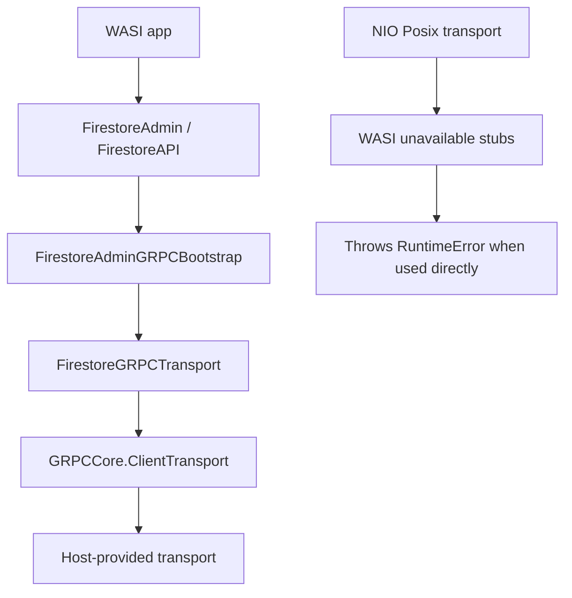

# Firestore Wasm Boundary

Status: Admin/API targets build for WASI; runtime requires a host-provided gRPC `ClientTransport`

Last reviewed: 2026-06-28

## Decision

The package supports building the Firestore Admin surface for WebAssembly/WASI with the selected Swift SDK.

`FirestoreAdmin` and `FirestoreAPI` now compile for `swift-6.3.1-RELEASE_wasm`. The concrete NIO Posix transport is still not executable on WASI because WASI does not provide the POSIX socket and event-loop primitives used by `ClientBootstrap`, `ServerBootstrap`, DNS resolution, and file-backed TLS loading. The forked networking dependencies expose explicit WASI stubs for those unavailable Posix paths so the Admin product can build and host environments can provide their own transport.

The supported runtime path for Wasm is:

1. Import `FirestoreAdmin` or `FirestoreAPI`.
2. Provide a `GRPCCore.ClientTransport` implemented by the host environment.
3. Construct `Firestore` with the public custom-transport initializer.
4. Use service credentials, ADC, a custom access token provider, `FirestoreSettings.hostManagedAuthentication(...)` for host-attached authentication, or emulator settings for unauthenticated local checks.

## Verified Compatible Targets

The following targets are expected to build with `swift-6.3.1-RELEASE_wasm`:

| Target | Responsibility |
|---|---|
| `FirestoreCore` | Firestore model, reference, query, snapshot, path, error, aggregation, Explain, and vector descriptor values |
| `FirestoreMongo` | Mongo-compatible query/index document builders |
| `FirestoreGeoQuery` | Native geohash GeoQuery planning and exact distance helpers |
| `FirestorePipeline` | Enterprise Pipeline descriptors and result values |
| `FirestoreCodable` | SDK-compatible Codable conversion helpers |
| `FirestoreRuntimeConfig` | Server runtime settings and retry configuration values |
| `FirestoreRuntimeSupport` | Transport-agnostic runtime protocol composition |
| `FirestoreProtobuf` | Generated Firestore protobuf message types |
| `FirestoreRPCSupport` | Shared protobuf document decoding |
| `FirestoreRPC` | Native Firestore request compilers, response mappers, and listen reducers |
| `FirestorePipelineRPC` | Enterprise Pipeline request compiler and response mapper |
| `FirestoreAdminCore` | Transport-agnostic server-side Admin workflow facade |
| `FirestoreAdminCodable` | Codable convenience adapters over the Admin facade |
| `FirestoreAuthCore` | Token-provider contracts and Firestore OAuth scopes |
| `FirestoreAuth` | Service-account and ADC authentication types; default HTTP requesters are unavailable without host HTTP support |
| `FirestoreGRPCStubs` | Generated grpc-swift client stubs |
| `FirestoreGRPCTransport` | Runtime adapter from Admin operations to grpc-swift transport abstractions |
| `FirestoreAdminGRPCBootstrap` | Public Admin construction for credentials, emulator, ADC, custom access token providers, and custom host transports |
| `FirestoreAdmin` | Preferred server-side Admin import |
| `FirestoreAPI` | Compatibility all-in-one import |

## Transport Boundary



## Verification

Run:

```bash
bash scripts/check-wasm-compatible-targets.sh
```

This check builds the Admin/API target set with `swift-6.3.1-RELEASE_wasm` and runs `scripts/run-wasm-admin-smoke.sh` by default. The runtime smoke constructs `Firestore` with a host-provided `ClientTransport` and `FirestoreSettings.hostManagedAuthentication(...)`, then executes a batch commit until the smoke transport reports an explicit unimplemented RPC. Directly using the default Posix bootstrap on WASI should fail with an explicit transport error.

## Remaining Runtime Work

| Component | Required boundary |
|---|---|
| Production Wasm transport | Host implementation of `GRPCCore.ClientTransport`, such as a JavaScript bridge, WASI host function bridge, or server proxy |
| Production Wasm authentication | `FirestoreSettings.hostManagedAuthentication(...)` for host transport authentication, a host HTTP bridge, or a pre-issued token provider for OAuth token exchange |
| Direct NIO Posix networking | Not supported by WASI; kept as explicit unavailable stubs |
